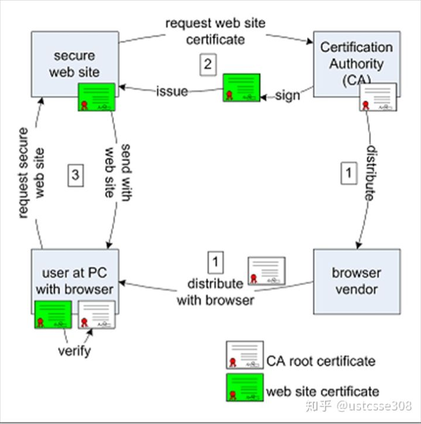

# 1 HTTPS

- HTTP协议
- 明文传输的安全隐患
- HTTPS的工作原理
- 证书的生成过程
- 网站和浏览器身份验证和建立安全连接的过程
- CA的作用，非对称加密中公钥加密私钥签名的原理
- HTTPS带来的安全保护
- HTTPS的局限性

## 1.1 HTTP语法结构

### 1.1.1 HTTP/0.9

诞生于1991年，最开始只有一个`GET`命令。语法如下：

```http
GET /index.html
```

​	命令表示，TCP连接(connection)建立以后，客户端向服务器请求(request)网页`index.html`

​	根据协议，服务器响应的只能是HTMP格式的字符串，不能是其他格式。

```html
<html>
    <body>
        Hello World
    </body>
</html>
```

​	在服务器发送完毕之后，就关闭了TCP连接。

### 1.1.2 HTTP/1.0

​	在1996年5月发布，对比而言，HTTP/1.0能够传输任何格式，使得狐狸啊我那个不仅能够传输文字，还能传输图像、视频、二进制文件。

​	在命令上，除了`GET`命令，还引入了`POST`和`HEAD`命令。

​	再者，HTTP请求和回应的格式也发生了改变，除了数据部分，每次通信都必须包括头信息（HTTP header），用来描述一些元数据。

一个请求格式的example如下：

```HTTP
GET /HTTP/1.0
User-Agent: Mozilla/5.0 (Macintosh; Intel Mac OS X 10_10_5)
Accept: */*
```

第一行是请求命令，必须在尾部添加协议版本`HTTP/1.0`，后面就是多行头部信息，用来描述客户端的情况。

一个响应的example如下：

```http
HTTP/1.0 200 OK 
Content-Type: text/plain
Content-Length: 137582
Expires: Thu, 05 Dec 1997 16:00:00 GMT
Last-Modified: Wed, 5 August 1996 15:55:28 GMT
Server: Apache 0.84

<html>
  <body>Hello World</body>
</html>
```

响应的格式是“头信息 + 一个空行`\r\n`+数据。”其中第一行是"协议版本 + 状态码(status code) + 状态描述。"

#### 1.1.2.1 Content-type字段 

​	关于字符的编码，1.0版规定，头信息必须是 ASCII 码，后面的数据可以是任何格式。因此，服务器回应的时候，必须告诉客户端，数据是什么格式。

常见的Content-type字段如下：

```http
text/plain
text/html
text/css
image/jpeg
image/png
image/svg+xml
audio/mp4
video/mp4
application/javascript
application/pdf
application/zip
application/atom+xml
```

这些数据类型的总称呼是`MIME type`,每一个值都包括一个一级类型和一个二级类型，之间用斜杠分割。

除了预定以类型，厂商也可以自定义类型：

```http
application/vnd.debian.binary-package
```

如上所示，发送的是Debian系统的二进制数据包。

同时`MIME type`也可以在尾部使用分号，添加一些参数。

```http
Content-Type: text/html; charset=utf-8 
```

上面的类型表明，发送的是网页，而且编码是UTF-8。

客户端请求的是偶，可以使`Accept`字段来声明自己可以接受哪些数据格式。

#### 1.1.2.2 Content-Encoding 字段

由于发送的数据可以是任何格式，因此可以把数据压缩后再发送。`Content-Encoding`字段说明数据的压缩方法。

```http
Content-Encoding: gzip
Content-Encoding: compress
Content-Encoding: deflate
```

客户端在请求时，用`Accept-Encoding`字段说明自己可以接受哪些压缩方法。

```http
Accept-Encoding: gzip, deflate
```

#### 1.1.2.3 缺点

​	HTTP/1.0的主要缺点就是，每一个TCP连接只能发送一个请求，数据发送完毕之后，连接就关闭了，入伙还要再请求其他的资源，就必须再建立一个新的连接。

​	但是TCP连接必须要经过客户端和服务器的三次握手，成本过大，而且在开始的时候，发送的速率比较慢。所以，HTTP/1.0的性能比较差。为了解决这个问题。有些浏览器在请求的时候，会使用一个非标准的字段`Connetion`来要求这个字段要求服务器不要关闭TCP连接，以便其他请求复用。服务器同样回应这个字段。

```http
#客户端
Connection: keep-alive
#服务器
Connection: keep-alive
```

一个可以复用的TCP连接就建立了，直到客户端或服务器主动关闭连接。但是，这不是标准字段，不同实现的行为可能不一致，因此不是根本的解决办法。

### 1.1.3 HTTP/1.1

​	在1997年1月，HTTP/1.1 版本发布，只比 1.0 版本晚了半年。它进一步完善了 HTTP 协议，一直用到了20年后的今天，直到现在还是最流行的版本。

#### 1.1.3.1 持久连接

​	1.1 版的最大变化，就是引入了持久连接（persistent connection），即TCP连接默认不关闭，可以被多个请求复用，不用声明。客户端和服务器发现对方一段时间没有活动，就可以主动关闭连接。不过，规范的做法是，客户端在最后一个请求时，发送`Connection: close`，明确要求服务器关闭TCP连接。

​	目前，对于同一个域名，大多数浏览器允许同时建立6个持久连接。

#### 1.1.3.2 管道机制

​	1.1 版还引入了管道机制（pipelining），即在同一个TCP连接里面，客户端可以同时发送多个请求。这样就进一步改进了HTTP协议的效率。

​	举个栗子：客户端需要请求两个资源。以前的做法是，在同一个TCP连接里面，先发送A请求，然后等待服务器做出回应，收到后再发出B请求。管道机制则是允许浏览器同时发出A请求和B请求，但是服务器还是按照顺序，先回应A请求，完成后再回应B请求。

#### 1.1.3.3 Content-Length 字段

​	一个TCP连接现在可以传送多个回应，势必就要有一种机制，区分数据包是属于哪一个回应的。这就是`Content-length`字段的作用，声明本次回应的数据长度。

```http
Content-Length: 3495
```

上面代码告诉浏览器，本次回应的长度是3495个字节，后面的字节就属于下一个回应了。这个字段在1.0中不是必须的，因为每个TCP只能发送一个请求。浏览器发现服务器关闭了TCP连接，就表明收到的数据包已经全了。

#### 1.1.3.4 分块传输编码

使用`Content-Length`字段的前提条件是，服务器发送回应之前，必须知道回应的数据长度。

对于一些很耗时的动态操作来说，这意味着，服务器要等到所有操作完成，才能发送数据，显然这样的效率不高。更好的处理方法是，产生一块数据，就发送一块，采用"流模式"（stream）取代"缓存模式"（buffer）。

因此，1.1版规定可以不使用`Content-Length`字段，而使用分块传输编码（chunked transfer encoding）。只要请求或回应的头信息有`Transfer-Encoding`字段，就表明回应将由数量未定的数据块组成。

```http
Transfer-Encoding: chunked
```

每个非空的数据块之前，会有一个16进制的数值，表示这个块的长度。最后是一个大小为0的块，就表示本次回应的数据发送完了。下面是一个例子。

```http
HTTP/1.1 200 OK
Content-Type: text/plain
Transfer-Encoding: chunked

25
This is the data in the first chunk

1C
and this is the second one

3
con

8
sequence

0
```

#### 1.1.3.5 其他功能

1.1版还新增了许多动词方法：`PUT`、`PATCH`、`HEAD`、 `OPTIONS`、`DELETE`。

另外，客户端请求的头信息新增了`Host`字段，用来指定服务器的域名。

> ```http
> Host: www.example.com
> ```

有了`Host`字段，就可以将请求发往同一台服务器上的不同网站，为虚拟主机的兴起打下了基础。

#### 1.1.3.6 缺点

​	虽然1.1版允许复用TCP连接，但是同一个TCP连接里面，所有的数据通信是按次序进行的。服务器只有处理完一个回应，才会进行下一个回应。要是前面的回应特别慢，后面就会有许多请求排队等着。这称为["队头堵塞"](https://zh.wikipedia.org/wiki/%E9%98%9F%E5%A4%B4%E9%98%BB%E5%A1%9E)（Head-of-line blocking）。

​	为了避免这个问题，只有两种方法：一是减少请求数，二是同时多开持久连接。这导致了很多的网页优化技巧，比如合并脚本和样式表、将图片嵌入CSS代码、域名分片等等。如果HTTP协议设计得更好一些，这些额外的工作是可以避免的。

## 1.2 HTTP明文传输的安全隐患

​	在广播的环境中，明文传输的数据很容易就能够窃听到。课堂上演示的一个场景是：

​	同时启动两台虚拟机，他们是在同一个局域网中，然后我们使用其中一台虚拟机A登陆一个HTTP网站，在另外一台虚拟机B中启动wireshark抓包，并设置HTTP 数据包。在抓取到POST数据包中，我们能够抓取到A登陆时吼提交的表单，然后分析这个POST包，可以读取到具体的内容，也就是登陆时输入的用户名和密码。

​	另外一个场景是：我们进入的是一个钓鱼网站，攻击者的URL与正确的URL很像，但是攻击者控制的网站。也即，我们不能确定浏览器访问的网站就是我们确实想要访问的网站。

## 1.3 HTTPS

### 1.3.1 SSL(secure socket layer)

​	HTTPS(HTTP over TLS，HTTP over SSL或HTTP Secure)，它的实质是由HTTP进行通信，但是在通信的时候会使用SSL/TSL 来加密数据包，HTTPS开发的主要目的，是提供对网络服务器的身份认证，保护交换数据的隐私与完整性。IETF 就把 SSL 标准化，标准化之后的名称改为 TLS（是“Transport Layer Security”的缩写）。

​	SSL/TLS协议提供的服务主要有：

- 1 认证服务器和用户（可选地），确保数据发送到正确的客户机和服务器；（认证，Authentication）
- 2 加密数据以防止数据中途被窃取； (保密性，Confidentiality)
- 3 维护数据的完整性，确保数据在传输过程中不被改变。 (完整性，Integrity)

### 1.3.2 HTTPS建立过程



- 受信任的第三方机构CA自建证书，并告知浏览器，浏览器将CA根证书绑定（CA公私钥对的公钥）
- 网站服务器生成自己的公私钥对，并将自己的信息和公钥作为申请信息，要求CA颁发证书
- CA核实网站服务器的信息，然后用自己的私钥签名，并颁发给网站服务器。
- 网站服务器拿到了签过名的证书，将它配置在自己的服务器上
- 用户在访问网站时，浏览器会拿到签名证书，然后验证浏览器身份。

#### SSL的过程

- **客户端准备访问服务器，发出请求(ClientHello)**，此时会提供以下的信息

  - 客户端支持的协议版本，比如SSL1.0 或者 TSL1.0
  - 一个客户端生成的随机数，用于生成之后的“对话密码”也就是对称加密方式
  - 支持的加密方式，如RSA256
  - 支持的压缩方式

- **服务器回应客户端的请求(SeverHello)**

  ​	服务器将自己的证书发送给客户端。这个证书是对服务器的认证。由CA背书。如果服务器向客户端发售那个的证书中没有提供足够的信息（证书公钥）可以向客户端发送一个**Server Key Exchange信息？**

  ​	如果对于非常需要保密的信息，服务器也需要对客户端进行认证，发出Cerficate Request.如金融机构往往只允许认证客户连入自己的网络，就会向正式客户提供USB密钥，里面就包含了一张客户端证书。

  ​	服务器生成一个随机数发送给客户端。客户端和服务器使用这两个随机数产生Master Secret。
  ​	所以服务器在severHello阶段，发送的信息包括：

  - 确认使用的协议版本，如TSL1.0.如果服务器和客户端之间的版本不一直，服务器会关闭加密通信。
  - 一个服务器生成的随机数，用于后面生成“对话密码”
  - 确认使用加密的方式，比如RAS公钥
  - 服务器的证书

- 客户端再次回应(Certifiacte Verify)

  ​	**Client Key Exchange**

  ​	如果，服务器需要客户端进行验证。那么，在客户端收到服务端的server Hello之后，首先需要做的事就是，向服务器端发送客户端的证书，让服务端来验证客户端的合法性。

  ​	**Certifiacte Verify**

  ​	接下来，客户端（大部分情况下是浏览器）就需要对服务器的证书进行检查，如果证书不是可信任的机构颁布，或者证书中的域名和实际访问的不一致，或者证书己经过期，客户端会向用户显示一个警告，由用户决定是否还要继续通信。如果证书没有问题，客户端就会从服务器证书中取出服务器公钥。然后发送以下的信息：

  - 一个随机数，这个随机数使用服务器公钥加密，防止被窃听。

    这个随机数，是整个握手阶段出现的第三个随机数，它是客户端使用一些加密算法(例如：RSA, Diffie-Hellman)产生一个48个字节的Key，这个Key叫 PreMaster Secret，很多材料上也被称作 PreMaster Key。

  - 编码改变的通知，表示在之后通信双方的信息会采用特定的加密方式和密钥进行发送

  - 客户端SSL握手结束通知，表示客户端的握手阶段已经结束了。同时它返回的内容是前面所有发送过的内容的hash值，用来供服务器校验。

     **ChangeCipherSpec**

   	ChangeCipherSpec是一个独立的协议，体现在数据包中就是一个字节的数据，用于告知服务端，客户端已经切换到之前协商好的加密套件（Cipher Suite）的状态，准备使用之前协商好的加密套件加密数据并传输了。

  ​	在ChangecipherSpec传输完毕之后，客户端会使用之前协商好的加密套件和Session Secret加密一段 Finish 的数据传送给服务端，此数据是为了在正式传输应用数据之前对刚刚握手建立起来的加解密通道进行验证。

- 服务器最后的回应

  ​	服务端在接收到客户端传过来的 PreMaster 加密数据之后，使用私钥对这段加密数据进行解密，并对数据进行验证，也会使用跟客户端同样的方式生成 Session Secret。

  ​	一切准备好之后，会给客户端发送一个 ChangeCipherSpec，告知客户端已经切换到协商过的加密套件状态，准备使用加密套件和 Session Secret加密数据了。之后，服务端也会使用 Session Secret 加密一段 Finish 消息发送给客户端，以验证之前通过握手建立起来的加解密通道是否成功。

  ​	根据之前的握手信息，如果客户端和服务端都能对Finish信息进行正常加解密且消息正确的被验证，则说明握手通道已经建立成功，接下来，双方可以使用上面产生的Session Secret对数据进行加密传输了。

## 1.4 HTTPS带来的安全保护

- 对通信双方身份进行了验证
- 对通信的数据进行了加密

## 1.5 HTTPS的局限性

​	尝试自己理解一下：

- 加入的是受信任的第三方机构，但是这种信任并不能绝对的保存。且让他们背书也需要花钱。
- HTTPS如果在通信的中间有第三方C的话，C完全可以听到A和B的通信，并对通信内容进行拦截和替换。

## 1.6 实验理解：

​	在这一次实验中，我们使用的环境是：

- Ubuntu 14.04
- Apache 2.4
- OpenSSL

​	然后主要工作是，配置`apache2`服务器，保证我们能够使用`http:\\localhost`登陆进去自己本地服务器之后。手动配置CA证书并导入，主要过程如下：

- 生成CA的根证书和密钥

  - 根证书：`cacert.pem`
  - 私钥：`cakey.pem`

- 生成服务器公私钥

  - 公钥：`tempkey.pem`
  - 私钥：`tempreq.pem` 并将私钥转换成`unencrypted key`，更名:`server_key.pem`

- 使用CA的私钥对服务器进行签名

- 这个时候整理一下，有四个钥匙：

  - 服务器证书文件：server_crt.pem
  - 服务器密钥文件：server_key.pem
  - CA根证书：cacert.pem
  - CA密钥：cakey.pem

  这四个钥匙，CA根证书在浏览器，CA密钥用来给服务器签名，签名之后服务器端配置有服务器证书文件，服务器证书文件里包括：

  - 服务器的基本信息
  - 服务器的公钥

  浏览器确认服务器身份后会使用服务器的公钥加密信息并传输回去，这个信息包括：

  - 一个称为PreMaster Secret的随机数
  - 一个表示已经切换到协商好的对称加密并准备好通信的信号


