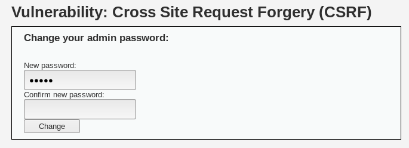
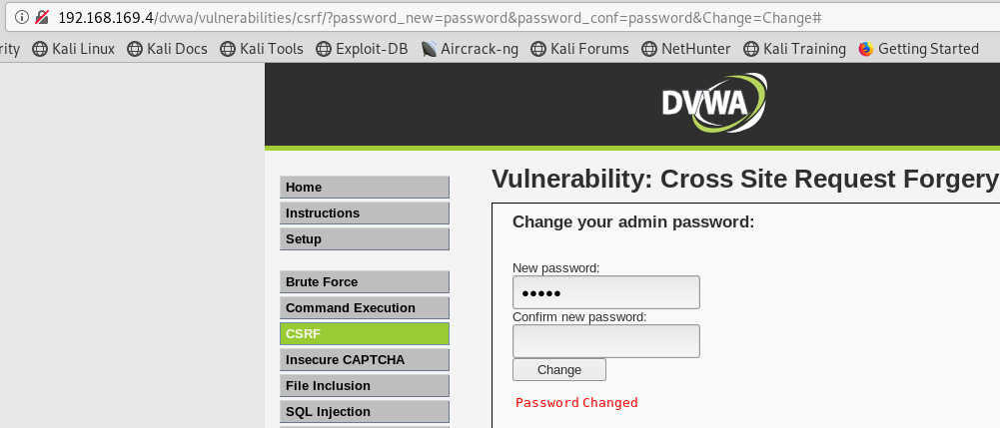
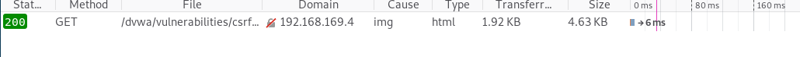

# CSRF

> 跨站点请求伪造（CSRF，Cross Site Request Forgery),是指利用受害者尚未失效的身份认证信息（cookie、会话等），诱骗其点击恶意链接或者访问包含攻击代码的页面，在受害人不知情的情况下以受害者的身份向（身份认证信息所对应的）服务器发送请求，从而完成非法操作（如转账、改密等）。CSRF与XSS最大的区别就在于，CSRF并没有盗取cookie而是直接利用。

## 1 CSRF攻击方式

1. 攻击者在自己的域中构造一个界面

   ```html
   <!--http://www.a.com/csrf.html-->
   
   
   ```

2. 攻击者诱导用户访问`a.com`，用户访问了页面之后，图片标签向服务器发送了get请求导致文章被删除

### 1.1 浏览器的Cookie策略

浏览器支持的Cookie分为两种：

- Session Cookie：临时Cookie，保存在浏览器进程的内存空间中，浏览器关闭Session Cookie失效
- Third-part Cookie：本地Cookie，保存在本地，浏览器从一个域的界面加载另外一个域的资源，一些浏览器会阻止Third-party Cookie的发送

### 1.2 P3P头的副作用

​	如果网站返回给浏览器的HTTP头包含有P3P头，那么将允许浏览器发送第三方Cookie。攻击如下:

- 在`http://www.a.com/test.php`中，是一个对a.com域设置Cookie的界面，内容如下:

  ```php
  <?php
      header("Set-Cookie: test=axis; domain=a.com; path=/");
  ?>
  ```

- 在`http://www.b.com/test.php`中，包含有一个对a的iframe，内容如下

  ```html
  <iframe width=300 height=300 src="http"//www.a.com/test.php"></iframe>
  ```

- 当请求b的时候，它的iframe会告诉浏览器去跨域请求`a.com`，`a.com/test.php`会尝试设置Cookie，所以浏览器会收到一个Cookie

- 如果成功的话，再次请求B的时候，浏览器会发送刚才设置的Cookie。原来由于跨域限制，在a上Set-Cookie是不会成功的，所以无法发送Cookie，但是由于P3P头允许跨域访问，导致cookie设置会成功。

### 1.3 GET&POST

在CSRF刚开始流行的时候，认为CSRF请求只能由GET方法发出，原因是，大多数CSRF发起攻击时都是使用``,`<iframe>`,`<script>`等只能发起一次GET请求的标签。

但是可以通过JavaScript来自动提交一个表单的方式构造一个POST请求实现CSRF

## 2 CSRF防御

### 2.1 验证码

CSRF的攻击之所以能够成功，很大程度上是因为在用户不知道的情况下构造了网络请求。而验证码则强制要求用户必须与应用进行交互才完成最终请求，但由于用户体验，不可能在每个连接上都加上验证码系统，所以不是很实用，只能作为一个辅助手段。

### 2.2 Referer Check

检查请求是否来自于合法的"源"。在用户进行操作的时候，Referer的值必然是当前操作所在的页面，如果不是，则很大概率是CSRF攻击。**Referer Check的缺陷在于，服务器并不是在任何时候都能取到Referer，用户处于隐私保护，有时候会限制Referer的发送，从HTTPS跳转到HTTP浏览器也不会发送Referer**

### 2.3 Anti CSRF token

**现在的一致做法**能够很好的防御CSRF攻击。

#### 2.3.1 CSRF的本质

CSRF之所以能够成功，**本质原因是重要操作的所有参数都是可以被攻击者猜到的**

攻击者只有预测到url的所有参数和参数值，才能成功的构造一个伪造的请求。如果将参数加密，或者使用一些随机数，从而让攻击者无法猜到参数值，就可以实现防御，eg:

```url
//一个删除操作的url是如下:
http://host/path/delete?username=abc&item=123

//如果将username改为hash值
http://host/path/delete?username=md5(salt+abc)&item=123
```

如果攻击者不知道salt，是无法构造出这个URL的，因此就无法发起CSRF攻击了，而服务器可以从Session或者Cookie中获取到username的值，然后结合salt对请求进行验证，正常请求会被认为是合法的

**问题：加密或者混淆之后的URL难读，对用户不友好；由于salt随机，用户没法收藏salt**

解决方法，使用一个Anti token：保持原来的参数不变，新增加一个Token,这个Token是随机，不可预测的:

```url
http://host/path/delete?username=abc&item=123&token={random(seed)}
```

这个token足够随机，且只被用户和服务器共同持有，其他人不能知晓的。Token可以放在用户的Session中，或者放在浏览器的Cookie中

- token需要同时放在表单和用户的Session(或者Cookie)中,提交请求时，服务器验证表单中的Token与用户Session中的Token是否一致即可

```text
tips:
Session是在服务端保存的一个数据结构，用来跟踪用户的状态，这个数据可以保存在集群、数据库、文件中；
Cookie是客户端保存用户信息的一种机制，用来记录用户的一些信息，也是实现Session的一种方式。
```

### 2.3.2 Token使用原则

1. Token设计时根据不可预测性原则设计的，所以Token的生成一定要有足够的随机
2. Token的目的不是为了防止重复提交，所以允许一个Token持续一个生命周期
3. Token保存在Cookie中会有一个一个问题是，当用户打开多个相同页面操作的时候，某个页面消耗了Token其他页面的表单再次提交会出现Token错误，所以需要考虑生成多个有效的Token
4. TOken使用的时候要注意保密性

## 3 DVWA 实战



分析：CSRF是通过利用受害者的Cookie，向服务器伪造请求，属于直接利用Cookie的过程。这个界面展示了受害者在修改密码时可能遭受的CSRF攻击，如下：

### 3.1 低安全级别

```php
 <?php
                
    if (isset($_GET['Change'])) {
    
        // Turn requests into variables
        $pass_new = $_GET['password_new'];
        $pass_conf = $_GET['password_conf'];


        if (($pass_new == $pass_conf)){
            $pass_new = mysql_real_escape_string($pass_new);
            $pass_new = md5($pass_new);

            $insert="UPDATE `users` SET password = '$pass_new' WHERE user = 'admin';";
            $result=mysql_query($insert) or die('<pre>' . mysql_error() . '</pre>' );
                        
            echo "<pre> Password Changed </pre>";        
            mysql_close();
        }
    
        else{        
            echo "<pre> Passwords did not match. </pre>";            
        }

    }
?> 
```

服务器在收到修改密码的请求后，会检查`$pass_new == $pass_conf`，并没有任何csrf防御措施

**利用：**

**1. 构造链接**

```url
http://192.168.169.4/dvwa/vulnerabilities/csrf/?password_new=password&password_conf=passwor&Change=Change#
```

当受害者点击链接之后，就会修改密码



**2.构造短链接诱导用户点击**

利用工具，将上面构造的链接转换为短链接

**3.构造攻击界面**

钓鱼网站上诱导受害者点击，在点击的时候偷偷的完成攻击`csrf.html`

```html

```



### 3.2 中安全级别

```php
 <?php
            
    if (isset($_GET['Change'])) {
    
        // Checks the http referer header
        if ( eregi ( "127.0.0.1", $_SERVER['HTTP_REFERER'] ) ){
    
            // Turn requests into variables
            $pass_new = $_GET['password_new'];
            $pass_conf = $_GET['password_conf'];

            if ($pass_new == $pass_conf){
                $pass_new = mysql_real_escape_string($pass_new);
                $pass_new = md5($pass_new);

                $insert="UPDATE `users` SET password = '$pass_new' WHERE user = 'admin';";
                $result=mysql_query($insert) or die('<pre>' . mysql_error() . '</pre>' );
                        
                echo "<pre> Password Changed </pre>";        
                mysql_close();
            }
    
            else{        
                echo "<pre> Passwords did not match. </pre>";            
            }    

        }
        
    }
?> 
```

可以看到，添加一个检查 Referer的选项，这里检查的是判断HTTP_REFERER是否有`127.0.0.1`主机ip地址

**绕过：**

构造攻击页面为127.0.0.1.html

### 3.3 高安全级别

```php
<?php 

if( isset( $_GET[ 'Change' ] ) ) { 
    // Check Anti-CSRF token 
    checkToken( $_REQUEST[ 'user_token' ], $_SESSION[ 'session_token' ], 'index.php' ); 

    // Get input 
    $pass_new  = $_GET[ 'password_new' ]; 
    $pass_conf = $_GET[ 'password_conf' ]; 

    // Do the passwords match? 
    if( $pass_new == $pass_conf ) { 
        // They do! 
        $pass_new = mysql_real_escape_string( $pass_new ); 
        $pass_new = md5( $pass_new ); 

        // Update the database 
        $insert = "UPDATE `users` SET password = '$pass_new' WHERE user = '" . dvwaCurrentUser() . "';"; 
        $result = mysql_query( $insert ) or die( '<pre>' . mysql_error() . '</pre>' ); 

        // Feedback for the user 
        echo "<pre>Password Changed.</pre>"; 
    } 
    else { 
        // Issue with passwords matching 
        echo "<pre>Passwords did not match.</pre>"; 
    } 

    mysql_close(); 
} 

// Generate Anti-CSRF token 
generateSessionToken(); 

?> 
```

**漏洞利用：**

利用XSS漏洞窃取到token，然后使用token伪造CSRF攻击

### 3.4 impossable

```php
<?php 

if( isset( $_GET[ 'Change' ] ) ) { 
    // Check Anti-CSRF token 
    checkToken( $_REQUEST[ 'user_token' ], $_SESSION[ 'session_token' ], 'index.php' ); 

    // Get input 
    $pass_curr = $_GET[ 'password_current' ]; 
    $pass_new  = $_GET[ 'password_new' ]; 
    $pass_conf = $_GET[ 'password_conf' ]; 

    // Sanitise current password input 
    $pass_curr = stripslashes( $pass_curr ); 
    $pass_curr = mysql_real_escape_string( $pass_curr ); 
    $pass_curr = md5( $pass_curr ); 

    // Check that the current password is correct 
    $data = $db->prepare( 'SELECT password FROM users WHERE user = (:user) AND password = (:password) LIMIT 1;' ); 
    $data->bindParam( ':user', dvwaCurrentUser(), PDO::PARAM_STR ); 
    $data->bindParam( ':password', $pass_curr, PDO::PARAM_STR ); 
    $data->execute(); 

    // Do both new passwords match and does the current password match the user? 
    if( ( $pass_new == $pass_conf ) && ( $data->rowCount() == 1 ) ) { 
        // It does! 
        $pass_new = stripslashes( $pass_new ); 
        $pass_new = mysql_real_escape_string( $pass_new ); 
        $pass_new = md5( $pass_new ); 

        // Update database with new password 
        $data = $db->prepare( 'UPDATE users SET password = (:password) WHERE user = (:user);' ); 
        $data->bindParam( ':password', $pass_new, PDO::PARAM_STR ); 
        $data->bindParam( ':user', dvwaCurrentUser(), PDO::PARAM_STR ); 
        $data->execute(); 

        // Feedback for the user 
        echo "<pre>Password Changed.</pre>"; 
    } 
    else { 
        // Issue with passwords matching 
        echo "<pre>Passwords did not match or current password incorrect.</pre>"; 
    } 
} 

// Generate Anti-CSRF token 
generateSessionToken(); 

?> 
```

要求用户输入原始密码，在不知道原始密码的情况下，无论如何是不能构造CSRF攻击的