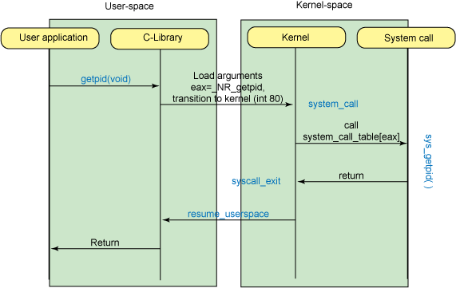
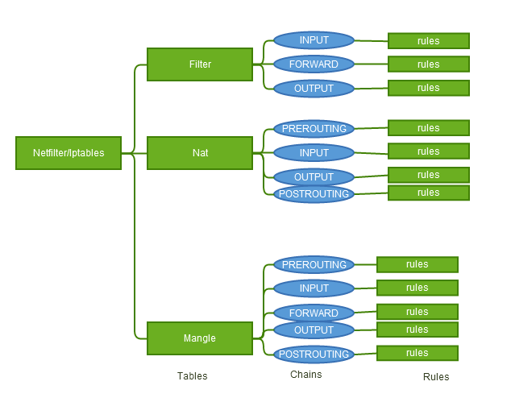
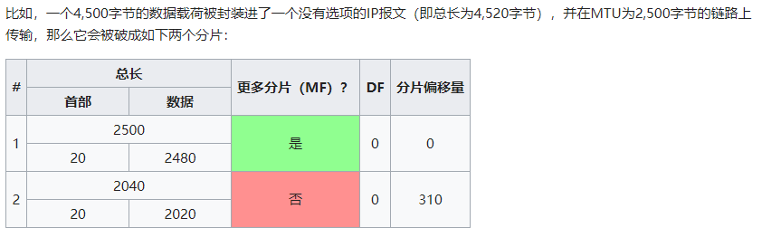

# 考试课程复习

## 1 缓冲区溢出

### 1.1 什么是返回地址

函数在执行过程中，会出现父函数执行过程中调用子函数情况，当子函数返回后，主函数继续执行的指令地址就称为返回地址，返回地址就是call指令后面的一条指令的地址，也就是`ip`寄存器入栈前的地址。

### 1.2 call 指令的作用

调用，`call function`指令实际上是由两个指令集合组成，`push ip + jump function `保存返回地址 + 跳转，在function结束之后调用`ret`指令，实质上是`pop ip`

### 1.3 函数调用发生时，进程地址空间中的栈帧的变化

栈帧就是一个函数执行的环境，可以简单理解为每一次函数调用涉及的相关信息的记录单元，其中寄存器`ebp`中

存放的是当前栈帧的底部(高地址)，寄存器`esp`中存放的是当前栈的栈顶(低地址)。一个简单的进程空间如下：


```c
void function(unsigned long a,unsigned long b, unsigned long c){
        unsigned long *ret;
        ret = (unsigned long*)((char*)&a + 32) ;
        (*ret)+= 7;
}

void main(){
        int x;
        x = 0;
        function(1,2,3);
        x = 1;
        printf("x is %d\n",x);
}
```

使用`objdump`反编译，查看`main()`函数和`function()`函数的汇编码


可以看到,变量a的位置在`-0x18(%rbp)`处，而64位系统中，使用8个字节存储`ret`,也就是说，想要取得返回地址，需要往回找$16+8+8 = 32$个字节，而栈中是从高地址到低地址，所以`a`的地址+32个字节就是返回地址：`ret = (unsigned long*)((char*)&a + 32) ;`

返回地址原来的位置是`x = 1`也就是`1189`,我们期望的的返回地址则是`1190`，相减`0x1190 - 0x1189 = 7`,所以返回地址+7:`(*ret)+= 7;`

首先是由于call指令而跳转到函数的，最上面存放的是`ret`指令，然后是定义栈底指针`ebp`，然后定义栈顶指针`esp`初始和`ebp`指向同一个位置，然后分配栈空间，由于栈在内存中是从大到小分配，所以分配栈空间的代码如：`sub $ox10, %esp`,然后再栈中存放基本数据结构和引用数据结构头部。函数执行完以后`ret`指令执行，`ip`指针从子函数返回主程序。

### 1.4 如何防止缓冲区溢出攻击

```c
char *shellcode = "\x48\x31\xff\x48\x31\xc0\xb0\x69\x0f\x05\x48\x31\xd2\x48\xbb\xff\x2f\x62\x69\x6e\x2f\x73\x68\x48\xc1\xeb\x08\x53\x48\x89\xe7\x48\x31\xc0\x50\x57\x48\x89\xe6\xb0\x3b\x0f\x05";

char large_string[256];

void main() {
        char buffer[96];
        int i;
        unsigned long *long_ptr = (unsigned long *) large_string;
        for (i = 0; i < 32; i++)
                *(long_ptr + i) = (unsigned long) buffer;
        for (i = 0; i < strlen(shellcode); i++)
                large_string[i] = shellcode[i];

        strcpy(buffer,large_string);
}
```

思想：使用`buffer`首地址填充`large_string`,然后将`shellcode`存放在`large_string` 的起始，这样再进行`strcpy`的时候，能够保证`buffer`是以`shellcode`开始的，而再拷贝过程中缓冲区溢出导致`main()`函数的返回地址被`large_string`后面一部分内容覆盖，也就是被`buffer`首地址覆盖，这样会导致函数执行完之后会执行`shellcode`


缓冲区溢出发生的原因是代码段的数据溢出到栈中，简单的构造思路是，在代码段中定义`shellcode`,然后人为的构造溢出，使得栈中函数的返回地址指向`shellcode`导致`shellcode`运行。

- 编译器进行canary和防止栈运行等防御

- 进行边界检查

- 部位接收数据预留相对较小的缓冲器，大的数组使用new/malloc分配堆空间
- 在将数据读入或者复制到目标缓冲区前，检查数据长度是否超过缓冲区空间的大小
- 检查不会将过大的数据传递给别的程序

## 2 Rootkit

### 2.0 权限管理

- real user ID: 实际上是属于谁的
- saved user ID:在程序执行时保存了有效用户ID的副本
- effective user ID：决定了文件访问权限

执行一个可执行文件时，进程的effective user ID通常是real user ID，但是可以设置特殊的标志，含义是“当执行此文件时，将进程的有效用户ID设置为可执行文件所有者的ID”。因此，当文件设置了`setuid`之后，实际用户ID和有效用户ID可能是不同的，此时的有效用户ID是文件所有者的ID。

- `setuid()`:设置调用进程的effective user ID，如果调用者的effective user ID是root，还会设置real user ID和saved user ID
- `seteuid()`:设置调用进程的effective user ID

### 2.1 什么是rootkit

对后门程序进行隐藏的一整套工具的集合，被攻击主机加载了一个后门，在操作系统中，我们从很多方面能够发现它，rootkit就是为了隐藏后门而设计的工具集，包括：文件隐藏，进程号隐藏，网络连接隐藏等等

### 2.2 LKM 好处是什么

全称为Loadable Kernel Modules，翻译为中文就是可加载内核模块，主要是用来扩展Linux内核的功能。

它的优点主要是可以动态地加载到内存中，无需重新编译内核，由于LKM具有这样的特点，所以它经常被用于一些设备的驱动程序，例如声卡，网卡等等。

### 2.3 描述系统调用劫持的过程



- 用户调用`getpid(void)`库，C标准库在一个段寄存器中存储`getpid`的系统调用号，并启动`0x80`中断，执行`system_call`函数。这个函数处理的是由`eax`内容标识的所有系统调用，然后经过一些步骤之后，它调用真正的系统调用`sysytem_call_table`和`exa`中存放的中断索引。从系统调用返回之后，`sysytemcall_exit`退出系统调用，并从内核态返回用户态，将结果返回给用户。
- 系统调用劫持就是采取一些手段，获得`system_call_table`的地址，然后修改系统调用的指针，获得`system_call_table`的方法有：
  - 从`/boot/System.map`中读取：system.map是系统的映射，具体的内容是内核符号和其所在内存地址的映射，通过地址可以找到符号，通过符号也能找到地址。直接查找就能拿到系统调用表的内存地址。
  - 确定大概范围然后将其与我们导出的符号进行比较：在一个空间中暴力搜索，如我们知道close想对系统调用表的偏移是6,设置一个指针，从一个大概的空间中暴力搜索，只要它的这个指针+偏移量和`sys_close`匹配时，我门就成功的在内存中找到了`sys_call_table`

- 上课讲的方法

从2.1的图中我们能够看到中断向量表的工作过程。

> - 用户进程在执行系统调用前，先将系统调用号，输入的参数等放在寄存器中。
> - 发出0x80中断，也就是128号中断
> - 系统暂停用户进程，根据128号中断在终端向量表中找到中断服务程序system_call
> - 128号中断的中断服务程序system_call紧接着执行。在进行必要的处理后，**统一调用 call `sys_call_table(%eax,4)`来调用sys_call_table表中的系统调用服务**，`eax`存放的即时系统调用号；执行完毕后它又会把输出结果放到寄存器中。
> - 系统恢复用户进程，进程从寄存器中取到自己想要的东西，然后继续执行。

根据过程，我们有利一下获取`sys_call_table`的思路：

> - 利用`sidt`指令，得到IDT地址
> - 在IDT中，找到0x80号向量中断服务程序地址`system_call`
> - 从0x80号中断服务程序的地址开始硬编码搜索` \xff\x14\x85`(x86)，` \xff\x14\xc5`(x64)也就是`call`指令二进制格式，而中断调用语句是:`sys_call_table(%eax,4)`

```c
unsigned long  *find_sys_call_table(void)
{
	unsigned int sys_call_off;
	char *p;
	int i;
	unsigned int ret;
    
    //调用idtr指令，然后将加载出来的中断描述符表寄存器中的内容存入我们之前准备好的的idtr结构体
	asm("sidt %0":"=m"(idtr));
    //获取0×80中断所对应的IDT中的表项。中断描述符表共256项，每项8字节，每项代表一种中断类型。所以我们要从IDR起始地址后的8*0×80位置拷贝一个IDT表项大小的数据，也就是0×80中断所对应的IDT中的表项
	memcpy(&idt, idtr.addr+8*0x80, sizeof(idt));
    //这条语句获取的是128号中断的中断服务程序system_call的地址
	sys_call_off = ((idt.offset_2<<16) | idt.offset_1);
	p = sys_call_off;
    //搜索\xff\x14\x85，得到sys_call_table地址。
	for(i=0; i<100; i++)
	{
		if(p[i]=='\xff' && p[i+1]=='\x14' && p[i+2]=='\x85')
			ret = *(unsigned int *)(p+i+3);
	}
	printk("Arciryas:sys_call_table-0x%x\n", ret);
	return (unsigned long**)ret;
}
```

### 2.4 解释一下 Unix 为何做到一切皆文件

Unix 内核使用虚拟文件系统VFS进行文件系统管理，所有的文件在挂载之后对于用户层来说，调用`vfs`的相关功能就可以实现对不同的文件系统的管理，而VFS 定义了所有文件系统都支持的基本的、概念上的接口和数据 结构；同时实际文件系统也提供 VFS 所期望的抽象接口和数据结构，将自身的诸如文件、目录等概念在形式 上与VFS的定义保持一致。

## 3 防火墙

### 3.0 Iptables/Netfilter是什么

```text
1. Netfilter是Linux操作系统核心层内部的一个数据包处理模块，它具有如下功能:
    1) 网络地址转换(Network Address Translate)
    2) 数据包内容修改
    3) 以及数据包过滤的防火墙功能
Netfilter平台中制定了五个数据包的挂载点(Hook Point，我们可以理解为回调函数点，数据包到达这些位置的时候会主动调用我们的函数，使我们有机会能在数据包路由的时候有机会改变它们
的方向、内容)，这5个挂载点分别是
    1) PRE_ROUTING
    2) INPUT
    3) OUTPUT
    4) FORWARD
    5) POST_ROUTING
2. Iptables
Netfilter所设置的规则是存放在内核内存中的，Iptables是一个应用层(Ring3)的应用程序，它通过Netfilter放出的接口来对存放在内核内存中的Xtables(Netfilter的配置表)进行修改
```

我们知道Netfilter是负责实际的数据流改变工作的内核模块，而Xtables就是它的规则配置文件，Netfilter依照Xtables的规则来运行，Iptables在应用层负责修改这个规则文件。

Xtables由"表Mangles"、"链Chains"、"规则Rules"组成:



```
1. Filter(表)
filter表是专门过滤包的，内建三个链，可以毫无问题地对包进行DROP、LOG、ACCEPT和REJECT等操作 
    1) INPUT(链)
    INPUT针对那些目的地是本地的包
        1.1) 规则rule
　　　　    ..
    2) FORWARD(链)
    FORWARD链过滤所有不是本地产生的并且目的地不是本地(即本机只是负责转发)的包
        2.1) 规则rule
　　　　    ..
    3) OUTPUT(链)
    OUTPUT是用来过滤所有本地生成的包
        3.1) 规则rule
　　　　    ..
2. Nat(表)
Nat表的主要用处是网络地址转换，即Network Address Translation，缩写为NAT。做过NAT操作的数据包的地址就被改变了，当然这种改变是根据我们的规则进行的。属于一个流的包(因为包
的大小限制导致数据可能会被分成多个数据包)只会经过这个表一次。如果第一个包被允许做NAT或Masqueraded，那么余下的包都会自动地被做相同的操作。也就是说，余下的包不会再通过这个表
，一个一个的被NAT，而是自动地完成
    1) PREROUTING(链)
    PREROUTING 链的作用是在包刚刚到达防火墙时改变它的目的地址
        1.1) 规则rule
　　　　    ..
    2) INPUT(链)
        2.1) 规则rule
　　　　    ..
    3) OUTPUT(链)
    OUTPUT链改变本地产生的包的目的地址
        3.1) 规则rule
　　　　    ..
    4) POSTROUTING(链)
    POSTROUTING链在包就要离开防火墙之前改变其源地址。
        4.1) 规则rule
　　　　    ..
3. Mangle(表) 
这个表主要用来mangle数据包。我们可以改变不同的包及包 头的内容，比如 TTL，TOS或MARK。 注意MARK并没有真正地改动数据包，它只是在内核空间为包设了一个标记。防火墙内的其他的规
则或程序(如tc)可以使用这种标记对包进行过滤或高级路由。注意，mangle表不能做任何NAT，它只是改变数据包的TTL，TOS或MARK，而不是其源目地址。NAT必须在nat表中操作的。
    1) PREROUTING(链)
    PREROUTING在包进入防火墙之后、路由判断之前改变 包
        1.1) 规则rule
　　　　    ..
    2) INPUT(链)
    INPUT在包被路由到本地之后，但在用户空间的程序看到它之前改变包
        2.1) 规则rule
　　　　    ..
    3) FORWARD(链)
    FORWARD在最初的路由判断之后、最后一次更改包的目的之前mangle包
        3.1) 规则rule
　　　　    ..
    4) OUTPUT(链)
    OUTPUT在确定包的目的之前更改数据包
        4.1) 规则rule
　　　　    ..
    5) POSTROUTING(链)
    POSTROUTING是在所有路由判断之后
        5.1) 规则rule
　　　　    ..
```

### 3.1 iptables是状态防火墙，相比包过滤防火墙优缺点是什么

#### 静态包过滤防火墙对数据包的处理规则如下：

1. 接受每一个到达的数据包
2. 对数据包按序匹配过滤规则，对数据包的IP头部和传输字段的内容进行检查。如果规则匹配数据包，根据该规则决定是丢弃数据包还是转发数据包
3. 如果没有规则匹配，则是默认规则

静态包过滤防火墙进检查当前的数据包，判决仅仅依赖于当前数据包的内容，检查部分包括：源IP，目的IP，应用或者协议号，源端口，目的端口。

**优点**：

- 对网络性能影响小
- 成本低
- 对用户透明

**缺点：**

- 难以处理分片
- 缺少状态感知能力
- 容易受到IP欺骗攻击
- 创建访问控制规则困难
- 不支持某些复杂的协议
- 不能防止应用层恶意攻击

#### 状态防火墙（动态包过滤防火墙）

1. 对新建的应用连接，状态检测检查预先设置的安全规则，允许符合规则的连接通过，并在内存中记录下该连接的相关信息，生成状态表。对该连接的后续数据包，只要符合状态表，就可以通过。


优点：

- 高安全性
- 高性能
- 易扩展

缺点：

- 消耗资源
- 难以创建规则，管理源创建规则的时候必须考虑规则的先后次序

### 3.2 NAT的作用是什么

网络地址转换：它是一种把内部私有网络地址（IP地址）翻译成合法网络IP地址的技术。

譬如由于IPv4地址匮乏，一个机构中有十台主机需要上网，但是这个机构只分配到了一个公网IP。在局域网内部，这十台主机可以使用私有地址进行通信；但是为了获得公网中的服务，必须使用公网IP。NAT就可以用于解决这个问题。**SNAT： 内网主机向外发出数据包时，修改网络包源ip，内网的设备经过防火器（路由器等）接入到互联网时**；**DNAT：设置外网（互联网）用户访问我们防火墙的外网IP所提供的服务（http ssh ftp等）时，将防火墙外网IP提供的服务映射回内网服务器**。


### 3.3 `sudo iptables –P INPUT DROP； iptables -A INPUT -p tcp --sport 80 -j ACCEPT` 这两条语句的作用是什么？

**iptables例子：设定：**

**内网服务器S：192.168.116.160**

**代理 P：192.168.116.141**

**外网主机C：192.168.116.1**

场景1:

```shell
外网主机想要访问内网服务器，如果直接访问，被墙，启用代理，访问代理端口，规则如下：

1. 
C to P : 源ip:192.168.116.1
		 目的ip:192.168.116.141：8123
代理 P设定了规则，使用iptables修改Xtables文件：
# -t nat:对nat表进行操作
# -A 添加规则
# PREROUTING:在包刚刚到达防火墙时改变它的目的地址
# -p tcp 指定匹配连接时TCP 连接
# --dport:指定连接端口号是8123
# -j DNAT:更改目标是将外网访问防火墙的外网ip提供的服务映射回内网，修改目的ip
iptabls -t nat -A PREROUTING -p tcp --dport:8123 -j DNAT -to 192.168.116.160:80
更改后: 源ip:192.168.116.1
	   目的ip:192.168.116.160:80
2.
P to S: 源ip:192.168.116.1
	    目的ip:192.168.116.160:80
同样设定规则:
# -t nat:对nat表进行操作
# -A 添加规则
# POSTROUTING：POSTROUTING链在包就要离开防火墙之前改变其源地址。
# -p tcp 指定匹配连接时TCP 连接
# -s 指定过滤源地址是 192.168.116.1 的包
# -j SNAT 更改源地址
iptables -t nat -A POSTROUTING -p tcp -s 192.168.116.1 -j SNAT -to 192.168.116.141
更改后: 源ip:192.168.116.141
	   目的ip:192.168.116.160:80

服务器回传数据到外网主机:
3.
S to P: 源IP：192.168.116.160:80
		目的ip:192.168.116.141
设定规则:

# 源地址是192.168.116.160:80的数据包目的地址改为192.168.116.1
iptables -t nat -A PREROUTING - p tcp -s 192.168.116.160 --sport:80 -j DNAT to 192.168.116.1
更改后: 源ip:1192.168.116.160:80
	   目的ip:192.168.116.1

4.
P to C:源ip:1192.168.116.160:80
	   目的ip:192.168.116.1
# 源地址是192.168.116.160:80的数据包的源地址改为192.168.116.141:8123
iptables -t nat -A POSTROUTING -p tcp -s 192.168.116.160 --sport:80 -j SNAT to 192.168.116.141:8123
更改后: 源ip:192.168.116.141:8123
	   目的ip:192.168.116.1
```

## 4 TCP 协议安全

### 4.1 什么是SYN flooding攻击？效果是什么？如何防止？

SYN flooding之前也讨论过，发生这种攻击的原因是因为TCP三次握手过程中的一个设计。当应用开放了一个TCP端口后，该端口就处于侦听状态，不停地监视发到该端口的SYN报文，一旦接收到SYN报文，就需要为即将建立的TCP连接分配TCB（Transmission Control Block），通常一个TCB至少需要280个字节，在某些操作系统中TCB甚至达到1300个字节；并且进入半开连接（half-opening）状态，也即收到SYN包而还未收到ACK包时的连接状态。操作系统实现的最多可开启的半开连接个数是一定的，譬如512，而受到内存的限制，可能还达不到这个数字。如果半开连接的个数过多，就会消耗掉可用的内存，使得新的正常的连接请求不能被处理。

防范：

- SYN Cache，收到SYN包的时候，再SYN Cache队列中生成一个项，保存基本信息，在收到ACK的时候检查SYN Cache，如果有合适的项，建立TCP请求之后，删除SYN Cache中的项

- SYN Cookie, 在ACK到达之前不分配任何资源。在接收到客户端的TCP SYN数据包时，服务器构造TCP SYN + ACK数据包发送回客户端。根据TCP规范，端点发送的第一个序列号可以是由该端点决定的任何值。在该数据包中的序列号的值不再是随机值，或者是其他方法生成的值，而是，SYN cookie根据以下规则精心构建的初始序列号：

  > 前5位：t mod 32. 设t是一个缓慢递增的时间戳（通常是time（）逻辑上右移6个位置，这给出了64秒的分辨率）
  > 中3位： 表示m的编码值 .令m为服务器在SYN队列条目中存储的最大段大小（MSS）值
  > 最后24位：s=Hash(server ip、port、client ip、port)
  >
  > 
  >
  > 当客户端向服务器发回ACK数据包后，服务器从确认号中减去1，得到发送给客户端的 SYN cookie，并执行检验：
  > 检查值t与当前时间，以查看连接是否已过期。
  > 重新计算s以确定它是否确实是一个有效的SYN cookie。
  > 从SYN cookie中的3位编码解码值m，然后可以使用它来重建SYN队列条目。
  >
  > SYN Cookie的缺点：
  > 服务器仅限于8个唯一的MSS值，因为它只能以3比特编码。

### 4.2 端口扫描的原理是什么？


向目标各端口发送SYN，若目标端口open，则建立连接，若close，则收到RST，若设置SYN过滤，则无回复。

优点：通过发包就课以判断目标主机的端口开放情况，不需要任何权限

缺点：发送大量的包，会留下痕迹

改进，使用root权限，直接干预发包，在收到目标的SYN+ACK后，不回复ack，而是回复RST，避免连接建立。


### 4.3 nmap -sS和nmap -sT的区别是什么？

普通权限的是nmap -sT

root权限的是nmap -sS

### 4.4 nmap -sA扫描的原理是什么？ 

nmap -sA扫描。顾名思义，-sA扫描是通过设置ACK位进行扫描的方法。ACK数据包不会启动会话建立，所以比较隐蔽；同时，因为ACK数据包不会单独出现，所以，对于端口，不管是开放的还是关闭的，如果收到一个不请自来的ACK数据包，都会发一个RST包。那这样的话，ACK扫描就不可能识别端口的开放和关闭情况。那么它有什么用呢？它可以识别端口有没有被过滤。


### 4.5 nmap idle扫描的原理是什么？

> - 在接收到到SYN数据包时，如果端口是开放的，那么会回复SYN|ACK，如果端口是关闭的，那么会回复RST。
> - 如果机器在没有发送SYN的情况下，收到一个SYN|ACK包，那么会回复RST。一个不请自来的RST会被忽略。
> - 每一个IP包都有identifier字段，用于标识属于同一数据包的所有IP碎片（下文称为IP ID）。
> - 每发一个IP数据包，很多操作系统对identifier字段简单地增加1。
> - 因此，针对identifier字段进行检测，可以判断主机距离上一次发包之后又发了几个数据包。

1. 探测僵尸主机的IPID并记录下来
2. 伪造僵尸主机发送数据包给目标主机，根据端口章台，目标主机可能会导致僵尸主机IP的ID值增加
3. 再探测僵尸主机的IP IP值，比较两次的ID。

端口开放情况：

1. 开放：
   1. 探测僵尸主机，僵尸主机发送RST，此时记录僵尸主机IP ID = 31337
   2. 伪造发包，僵尸主机收到一个不请自来的SYN/ACK包，发送RST，IP ID = 31338
   3. 在探测僵尸主机，僵尸主机发送RST，此时IP ID = 31339
2. 关闭
   1. 探测僵尸主机，僵尸主机发送RST，此时记录僵尸主机IP ID = 31337
   2. 伪造发包，僵尸主机收到一个不请自来的RST包，不回应IP ID = 31337
   3. 探测僵尸主机，僵尸主机发送RST，此时记录僵尸主机IP ID = 31338
3. 过滤
   1. 探测僵尸主机，僵尸主机发送RST，此时记录僵尸主机IP ID = 31337
   2. 伪造发包，僵尸主机收到一个不请自来的RST包，不回应IP ID = 31337
   3. 探测僵尸主机，僵尸主机发送RST，此时记录僵尸主机IP ID = 31338

可以看到无法区分关闭和过滤的情况，这种扫描方式，除了隐蔽性之外，还有一些原因。它的一个优势是有可能绕过防火墙。考虑到公司内部管理严密，但是对高管开放访问，在公司外部，只有来自高管的IP可以进入。这样，如果高管自己的主机能够充当zombie主机，攻击者就可以完成对内部主机的扫描。

## 5 ICMP协议安全

### 5.1 什么是SMURF攻击？如何防止？


攻击方式：冒充被攻击者 IP广播ICMP请求，target会收到大量ICMP回显回复，从而忙于处理ICMP而拒绝服务。

防御：使得主机不响应ICMP请求或者广播，或者使得路由器不转发广播数据包

### 5.2 什么是ICMP重定向攻击？如何防止？


主机的IP地址是10.0.0.100；主机的路由表中默认网关是10.0.0.1；现在主机100要向**网络X**发送数据包。根据自己的默认网关，100将数据发给了G1。G1检查自己的路由表，发现要到达**网络X**，需要经过G2 10.0.0.2。G1会将数据包转发给G2，同时发现数据包的源地址10.0.0.100和G2在同一个网段上，因此G1会知道，100应该将到**网络X**的数据包直接发给G2。这样的话，100的路由距离会更短。

因为主机100相信G1，所以它会更新自己的路由表，将到达**网络X**的路由改成是G2。

防御：使用防火墙过滤ICMP或手动关闭ICMP 重定向功能

## 6 IP协议安全问题


标志位+分片偏移设定分片：

**标志位三位：**

- 位0：保留，必须为0；
- 位1：禁止分片（Don’t Fragment，**DF**），当DF=0时才允许分片；
- 位2：更多分片（More Fragment，**MF**），MF=1代表后面还有分片，MF=0 代表已经是最后一个分片。
- 如果DF标志被设置为1，但路由要求必须分片报文，此报文会被丢弃。这个标志可被用于发往没有能力组装分片的主机。
- 当一个报文被分片，除了最后一片外的所有分片都设置MF为1。最后一个片段具有非零片段偏移字段，将其与未分片数据包区分开，未分片的偏移字段为0。

**分片偏移 （Fragment Offset）**

这个13位字段指明了每个分片相对于原始报文开头的偏移量，以8字节作单位。

**协议**字段:1, ICMP; 2 IGMP; 6 TCP; 17 UDP;

校验和：16位补码；仅针对头部计算；每一条都需要重新计算；


#### 针对IP分片可能出现的攻击思路：

1. DOS
2. Teardrop

DOS: 攻击者构造两个分片，一个偏移为0，另外一个分片的偏移设定为64800/8。因为IP分片会乱序到达，所以接收方会等待其他的分片，同时为其他分片分配内存空间，相当于每一个数据包都会消耗64K的内存，这段内存会保留到TTL，这样很快就可以耗尽主机内存

Teardrop:构造两个分片，第二个分片完全内包含在第一个分片中，依赖于一种当分片发生重叠时，重组的方法。如果主机的视线中选择在发生重叠时，使用第一个分片来覆盖第二个分片的重叠内容，那么Teardrop攻击就能够成功。

```c
if (prev != NULL && offset < prev->end){
    i = prev->end - offset;
    offset += i;/* ptr into datagram */
    ptr += i;/* ptr into fragment data */
    //advance to the end of the previous fragment
}
```


### 6.1 为什么IP要进行分片？

> 当设备收到IP报文时，分析其目的地址并决定要在哪个链路上发送它。MTU决定了数据载荷的最大长度，如IP报文长度比MTU大，则IP数据包必须进行分片。每一片的长度都小于等于MTU减去IP首部长度。接下来每一片均被放到独立的IP报文中，并进行如下修改：
>
> - 总长字段被修改为此分片的长度；
> - 更多分片（MF）标志被设置，除了最后一片；
> - 分片偏移量字段被调整为合适的值；
> - 首部检验和被重新计算。

例如，对于一个长20字节的首部和一个MTU为1,500的以太网，分片偏移量将会是：0、(1480/8)=185、(2960/8)=370、(4440/8)=555、(5920/8)=740、等等。



### 6.2 IP分片如何进行重组？

> 当一个接收者发现IP报文的下列项目之一为真时：
>
> - DF标志为0；
> - 分片偏移量字段不为0。
>
> 它便知道这个报文已被分片，并随即将数据、标识符字段、分片偏移量和更多分片标志一起储存起来。
>
> 当接受者收到了更多分片标志未被设置的分片时，它便知道原始数据载荷的总长。一旦它收齐了所有的分片，它便可以将所有片按照正确的顺序（通过分片偏移量）组装起来，并交给上层协议栈。

### 6.3 泪滴攻击（teardrop）的原理是什么？


```c
/**
 * 对于正常的重叠而言，计算还有多少拷贝的时候需要进行一下计算：
 * 第一个片起始位置:0,终止位置:1000
 * 第二个片起始位置:500,终止位置1500
 *
 * 计算重叠部分是第一个终止-第二个起始：500，然后第二个片起始位置右移动500，现在有：
 * 第一个片起始位置:0,终止位置:1000
 * 第二个片起始位置:1000,终止位置1500
 */
i = pre->end - offset; //重叠部分
offset += i; //往后移动重叠的部分
/**
 * 如果不正常
 * 第一个片起始位置:0,终止位置:1000
 * 第二个片起始位置:500,终止位置700
 * 计算重叠部分，还是500，然后第二个片起始位置右移动500，到达1000,就有:
 * 第一个片起始位置:0,终止位置:1000
 * 第二个片起始位置:1000,终止位置700造成溢出
 */
```


### 6.4 包过滤防火墙，通过过滤SYN包，防止外部链接。攻击者可以如何绕过这个过滤？假设防火墙filter的规则是：如果IP数据报的第一分片含有SYN，则拒绝这一分片，放行其他分片。

IP数据报最小分片长度为68字节，利用选项字段填满IP头=60字节，则第一分片数据部分可以只有8字节，第一分片只包含TCP头的前8字节，而SYN被放在了第二分片，从而避开了filter。此时第二分片的offset为1。

**微小碎片攻击：**第一个片段仅包含八个字节的数据（最小片段大小）。在TCP的情况下，这足以包含源和目标端口号，但它将强制TCP标志字段进入第二个片段。第二个段中包含SYN信息，尝试删除连接请求的过滤器（具有SYN = 1和ACK = 0的TCP数据报）将无法在第一个八位字节中测试这些标志，并且通常会在后续片段中忽略它们。

**碎片重叠攻击：**片段足够大以满足上一节中描述的大小要求。过滤器配置为丢弃TCP连接请求数据包。第一个片段包含值，例如，SYN = 0，ACK = 1，使其能够无损地通过过滤器。具有八个八位字节的片段偏移的第二片段包含与第一片段中给出的TCP标志不同的TCP标志，例如，SYN = 1，ACK = 0。由于该第二个片段不是0偏移片段，因此不会检查它，并且它也将通过过滤器。

## 7 ARP协议问题

### 7.1 ARP协议的作用是什么

>  以太网链路层协议，同一局域网的一台主机要和另外一台主机进行同学呢，必须知道目标主机的MAC地址，根据ip地址确定MAC地址的过程就是地址解析过程，使用的就是ARP协议，广播请求，单播回应
>
> 1. 主机 A 希望与主机B通信，但是只知道主机B的IP地址。
> 2. 主机A广播主机B的IP地址的ARP请求。
> 3. 所有本局域网内的主机都能收到这个广播包。
> 4. 只有主机B回复此包，携带上自己的MAC地址。
> 5. 主机A将B的IP地址和MAC地址的对应关系添加到自己的ARP缓存中。
> 6. 主机A构造对B的数据包。

报文格式：


### 7.2 引入ARP缓存的功能是什么

提高效率，如果没有ARP缓存，每次一发包之前都需要进行一次ARP请求，采用ARP缓存协议之后，再发送ARP请求之前会首先检查ARP缓存表，然后再决定是否发包。ARP缓存还使用老化机制，一段时间内表内某一行没有被使用，则将它从缓存表删除，保证了缓存表长度不会太长，提高效率。

### 7.3 ARP缓存中毒的攻击方法和效果是什么

攻击者发送假的ARP数据包到网络上，尤其是送到网关上。其目的是要让送至特定的IP地址的流量被错误送到攻击者所取代的地方。

- 因此攻击者可将这些流量另行转送到真正的网关（被动式数据包嗅探，passive sniffing）
- 或是篡改后再转送（中间人攻击，man-in-the-middle attack）
- 攻击者亦可将ARP数据包导到不存在的MAC地址以达到拒绝服务攻击的效果

> 例如某一的IP地址是`192.168.0.254`，其MAC地址为`00-11-22-33-44-55`，网络上的计算机内ARP表会有这一笔ARP记录。攻击者发动攻击时，会大量发出已将`192.168.0.254`的MAC地址篡改为`00-55-44-33-22-11`的ARP数据包。那么网络上的计算机若将此伪造的ARP写入自身的ARP表后，计算机若要透过网络网关连到其他计算机时，数据包将被导到`00-55-44-33-22-11`这个MAC地址，因此攻击者可从此MAC地址截收到数据包，可篡改后再送回真正的网关，或是什么也不做，让网络无法连线
>
> 这里用一个最简单的案例来说明ARP欺骗的核心步骤。假设在一个LAN里，只有三台主机A、B、C，且C是攻击者。
>
> 1. 攻击者聆听局域网上的MAC地址。它只要收到两台主机洪泛的ARP Request，就可以进行欺骗活动。
> 2. 主机A、B都洪泛了ARP Request.攻击者现在有了两台主机的IP、MAC地址，开始攻击。
> 3. 攻击者发送一个ARP Reply给主机B，把此包protocol header里的sender IP设为A的IP地址，sender mac设为攻击者自己的MAC地址。
> 4. 主机B收到ARP Reply后，更新它的ARP表，把主机A的MAC地址（IP_A, MAC_A）改为（IP_A, MAC_C）。
> 5. 当主机B要发送数据包给主机A时，它根据ARP表来封装数据包的Link报头，把目的MAC地址设为MAC_C，而非MAC_A。
> 6. 当交换机收到B发送给A的数据包时，根据此包的目的MAC地址（MAC_C）而把数据包转发给攻击者C。
> 7. 攻击者收到数据包后，可以把它存起来后再发送给A，达到偷听效果。攻击者也可以篡改数据后才发送数据包给A，造成伤害。

防御：


## 8 小常识

```shell
sudo netwox 80 -e "00:0c:29:A1:C0:71" -i 192.168.116.2    # ARP缓存攻击

sudo netwox 86 --gw "192.168.116.151"  --src-ip 192.168.116.2	# ICMP重定向攻击

sudo netwox 76 -i 192.168.116.210 -p 80		# 中间人攻击
```

## 米特尼克的圣诞攻击

1. 使用finger命令探测数据，找到能被利用的服务器ip
2. 利用TCP登陆实现服务器”半开“达到阻塞服务器的目的，使得它不会响应审核新连接的要求，要注意的是，它不会响应对意外的SYN-ACK生成TCP RST
3. 确定被攻击煮鸡蛋TCP序列号生成的规则
4. 伪造SYN，看起来像是从server到被攻击主机的，被攻击主机信任server
5. 被攻击主机使用SYN-ACK回复服务器，这个数据包需要收到一个ACK
6. 攻击者根据信息预测ACK并伪装成server发送ACK给被攻击主机
7. 连接建立，修改被攻击主机的配置，使得它信任任何人的连接
8. 断开伪连接，直接建立和被攻击主机建立连接

## 网络命令

```shell
ping www.baidu.com	# ping测试

ifconfig	#本机网卡信息

route	#本机路由表

traceroute www.baidu.com	# 路由查询

nslookup	# 域名查询

telnet	# 网络连接

whois	# 网页信息收集

netstat	# 显示网络连接

netcat(nc)	# 

nmap	# 端口扫描

```

