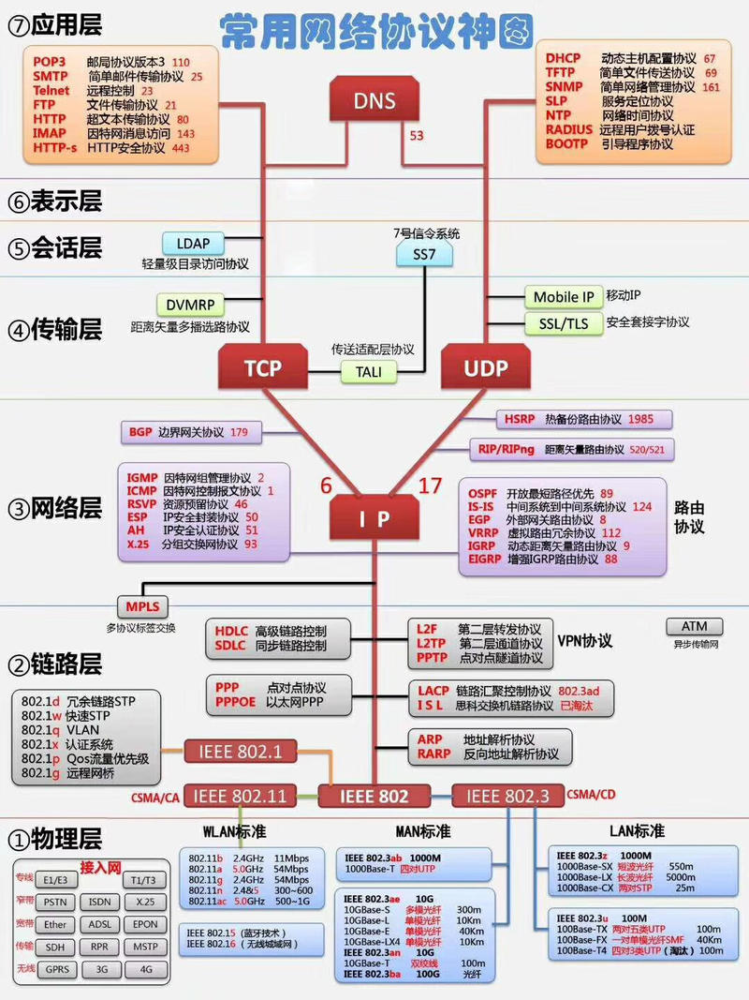

# 信息安全复习

## 草稿

- [ ] **ARP协议**问题，作用，缓存目的，攻击方法和效果，防御

- [ ] **IP协议**问题，IP如何分片， 重组，teardrop原理，效果，防御，包过滤防护墙如何绕过
- [ ] **ICMP协议**问题什么是SMURF攻击，防御；什么是ICMP重定向攻击，防御？
- [ ] **TCP协议**问题
- [ ] **防护墙**
- [ ] **Rootkit**
- [ ] **缓冲区溢出**

## 常用网络命令

```shell
ping www.baidu.com
ping 192.168.1.1
ping localhost

ifconfig -a # 查看网卡信息

route # 缺省路由信息
traceroute # 到目标ip的路由信息

nslookup # 域名查询

whois # 信息收集

netstat #显示存在的网络链接

netcat(nc) # 网络连接
目标主机:nc - l localhost 1234 > 1.txt
源主机:cat 1.txt | nc 192.168.116.144 1234

nmap
```

## ARP 攻击



