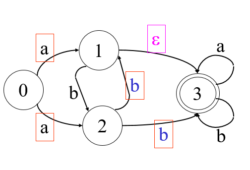
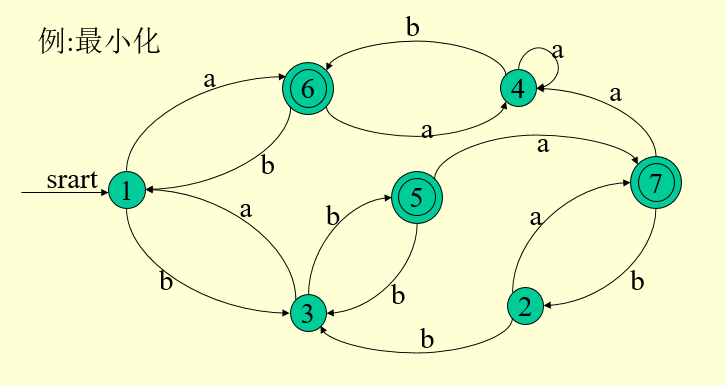

# 形式语言与自动机理论

## 1 形式语言

> **字母表 - ** 符号的非空有穷集a合，eg:  $\sum = \{a,b,c\}$  
>
> **符号串 - ** 由字母表$\sum$ 中的符号所组春哥的任何有穷序列
>
> **空符号串 - ** 无任何符号的符号串，记为$\varepsilon$ 
>
> 符号的运算包括连接，方幂，正闭包，自反闭包

**句子推导所需要的四部分**

1. **终结符号集$V_T$ = {a,b,c,d,e}**
2. **非终结符号集$V_N $={A,B,C,D}**
3. **语法规则集P**
4. **开始符号S**

### 1.1 文件发和语言的形式定义

#### 1.1.1 上下文无关文法 $G=(V_T,V_N,S,P)$

$V_T$ - 非空有穷 终结符号集合   $a,b,c,d$

$V_N$ - 非空有穷非终结符号集合  $A,B,C,D$

$(V_T \cup V_T)^*$ 文法符号串，由终结符号和非终结符号组成的符号串 $\alpha,\beta,\gamma,\delta$

$S \in V_N$,开始符号

P是一个产生式的非空有穷集合

**最左推导：**每一步哦都是对最左非终结符号进行替换

**最右推导：**每一步都是对最右非终结符号尽心替换，规范推导

**语言$L(G)**$是由文法G所产生的所有句子组成的集合

### 1.2文法的分类：

$G=(V_T,V_N,S,P)$

#### 1.2.1 0型文法：

**规则的形式如下：**

$\alpha \rarr \beta 其中 \alpha,\beta \in (V_T \cup V_N)^*,\alpha \ne \varepsilon$

由0型文法产生的语言称之为0型语言，例如图灵机TM

#### 1.2.2 1型文法(上下文有关文法)：

**产生式形式如下:**

$\alpha A \beta \rarr \alpha\gamma\beta$

$A \in V_N, \alpha,\beta \in (V_T \cup V_N)^*,\alpha \ne \varepsilon,\gamma  \in (V_T \cup V_T)^+$

仅有$S \rarr \varepsilon$除外，但是在这种情况下，S不能出现在任何产生式的右边

上下文有关语言1 线性界限自动机LBA

#### 1.2.3 2型文法(上下文无关文法)：

**规则的形式如下：**

$A \rarr \beta$

$A \in V_T, \beta \in (V_T \cup V_N)^*$

下推自动机PDA

#### 1.2.43型文法(正规文法)：

$A \rarr aB 或者 A \rarr a,A,B \in V_N,a \in V_T \cup \{\varepsilon\} $ (右线性)

$A \rarr Ba 或者 A \rarr a,A,B \in V_N,a \in V_T \cup \{\varepsilon\} $ (左线性)

有穷自动机 FA

## 2 自动机理论

### 2.1 有限自动机DFA

**一个确定的有限自动机DFA M是一个五元组** $M = ( \sum, S, S_0, Z, f)$

**其中：**

- $\sum$ 是一个字母表
- $S$ 是一个有限状态集合
- $S_0$是初始状态，$S_0 \in S$
- $Z$ 是终止状态集合，$Z是S的子集$
- $f$是 一个从$S \times \sum 到 S$的单值映射  $f(q,a) = q'(q,q' \in S, a \in \sum)$表示当前状态为q输入符号为a的时候，自动机将转换到下一个状态q',q'称为q的后继

### 2.3 非确定的有限自动机 NFA

NFA一样也是一个五元组，不同的是:

- $f是一个从S \times (\sum \cup \{\varepsilon\})$到S的子集的映射
- 非确定的有限自动机同一弧标记到达的状态节点不唯一
- NF初始状态集，DFA是一个唯一的初始状态
- NFA存在$\varepsilon$弧标记

eg:

### 2.4 NFA转DFA 子集构造法

集合的$\varepsilon$ 闭包      $\varepsilon-closure(I)$定义如下：

1. $如果 S \in I ,则 s \in \varepsilon-closure(I)$
2. $如果S \in I, 则从S触发经过任意条\varepsilon 弧线能够到达的任何状态都属于\varepsilon-closure(I) $

#### 构造等价DFA：

1. $如果t_1是NFA的初态，DFA的初态A= \varepsilon-closure(\{t_1\})$
2.  对NFA中每一个箭弧标记m，$计算\varepsilon-closure(f(q,m)),其中q为已生成DFA状态。遍历字母表的每个字符为输入 $

### 2.5 DFA最小化

找到一个最少状态的DFA M‘ 使得$ L(M) = L(M')$

DFA最小化等价于没有多余状态，且没有互相等价的状态。

一个DFA M可以通过消除多余状态和合并等价状态，从而转换成一个最小的与之等价的DFA

**分割法：** 把一个DFA(不含多余状态)的状态分割成一些不相关的子集，使得**任何不同的两个子集状态都是可区别的，而同一个子集中的任何状态都是等价的.**在各个子集中任取一个状态做代表，删去子集的其余状态。

